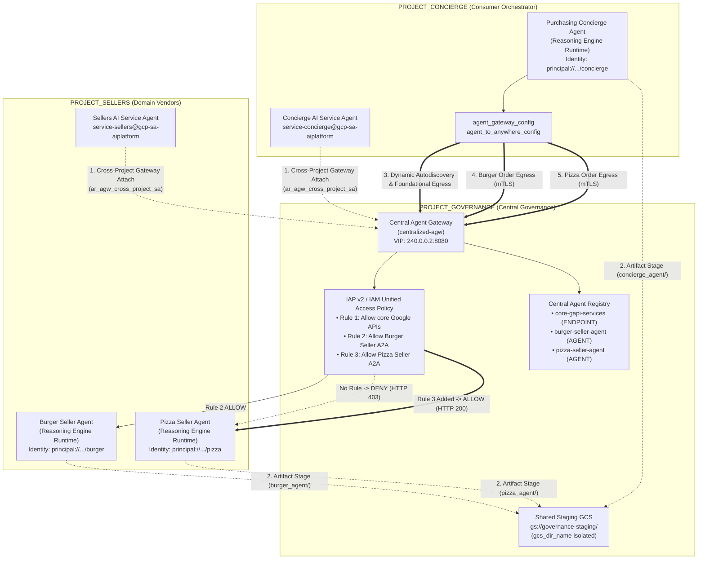
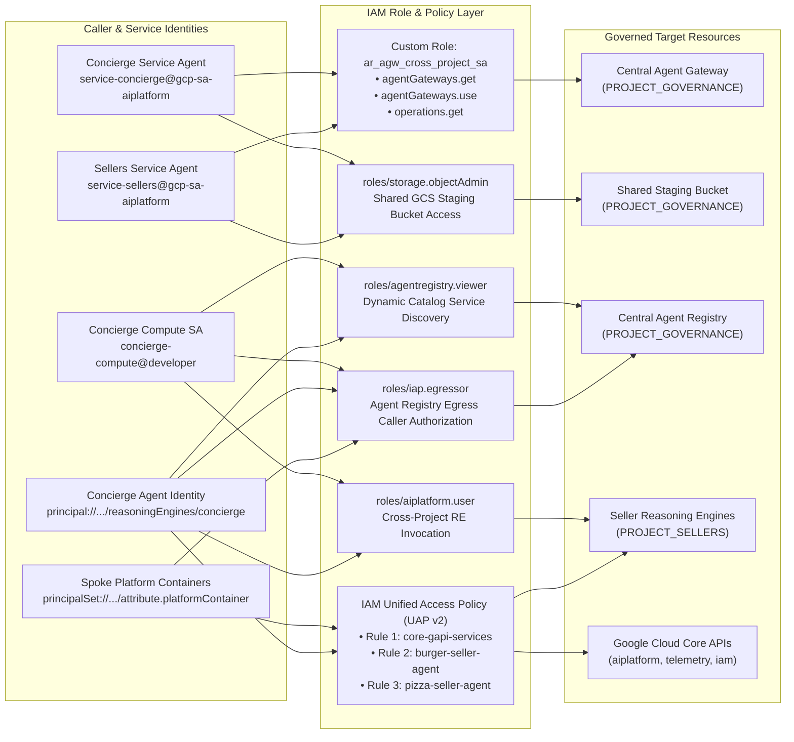

{# disableFinding(HEADING_NO_ID_H2) #}
{# disableFinding(HEADING_NO_ID_H3) #}
{# disableFinding("authz") #}

## Introduction
Duration: 05:00

As enterprise organizations adopt generative AI, architectures are rapidly
evolving from standalone, monolithic chatbots into **distributed multi-agent
systems (Agent-to-Agent / A2A)**. In these modern topologies, high-level
orchestrator agents coordinate complex business workflows by delegating tasks
to specialized domain worker agents, Model Context Protocol (MCP) tool servers,
and backend enterprise databases across independent Google Cloud projects.

However, operating multi-agent systems at scale introduces critical security,
governance, and operational challenges:
- **Shadow Agent & Tool Sprawl:** When development teams deploy agents in
  isolated projects without a centralized catalog, organizations lose
  visibility into which tools and subagents exist.
- **Unmonitored Cross-Project Egress:** Allowing agents direct, uninspected
  network routes creates data exfiltration risks and bypasses security
  perimeters.
- **Fragile Hardcoded Integrations:** Hardcoding downstream agent URLs and
  Reasoning Engine IDs creates brittle dependencies that break during upgrades
  or redeployments.
- **Lack of Least-Privilege Identity:** Shared service accounts fail to provide
  cryptographic non-repudiation at the individual agent instance level.

To solve these challenges, the **[Gemini Enterprise Agent Platform][01-01]**
provides a unified governance and connectivity control plane composed of four
core pillars:

1. **[Agent Gateway (`networkservices.googleapis.com`)][01-02]:**
   A managed, regional network and policy enforcement proxy. Operating in
   `AGENT_TO_ANYWHERE` egress mode, it intercepts outbound agent traffic,
   delegates authorization evaluations to security extensions, and routes
   requests across project perimeters.
2. **[Agent Registry (`agentregistry.googleapis.com`)][01-03]:**
   The single enterprise service catalog. It provides a centralized, vetted
   directory of all available tools, MCP servers, and peer agents across the
   organization, enabling dynamic runtime autodiscovery with zero hardcoded endpoints.
3. **[Agent Identity & IAP v2 Governance (`iap.googleapis.com` & `iam.googleapis.com`)][01-04]:**
   A cryptographic identity and access framework. Executing agents receive unique,
   attested SPIFFE machine URNs (`principal://...`). Outbound egress is evaluated
   against centralized **IAM Unified Access Policies (UAP / IAP v2)** verifying the
   universal permission `iap.googleapis.com/resources.egressViaIAP` using rich
   Common Expression Language (CEL) catalog conditions (`destination.agent_registry.*`).
4. **[Vertex AI Agent Runtime (Reasoning Engines)][01-09]:**
   A fully managed, serverless execution platform for Python-based agentic
   applications, featuring native configuration bindings (`agent_gateway_config`)
   to central gateways.

### The Codelab Business Scenario: Multi-Project Food & Beverage Purchasing
In this codelab, you will build and govern a real-world multi-project purchasing
ecosystem spanning three distinct Google Cloud projects:

- **Central Governance Project (`PROJECT_GOVERNANCE`):** Owned by Central IT and
  SecOps, hosting the Central Agent Gateway, Central Agent Registry, and IAM
  Unified Access Policies.
- **Consumer Orchestrator Project (`PROJECT_CONCIERGE`):** Owned by the
  procurement team, hosting the *Purchasing Concierge Agent* which dynamically
  discovers vendors and routes customer orders.
- **Domain Vendor Project (`PROJECT_SELLERS`):** Owned by external or departmental
  vendors, hosting the *Burger Seller Agent* and *Pizza Seller Agent*.

> aside positive
> **Architecture Best Practice Note:** In production enterprise deployments,
> using a Shared VPC with [Private Service Connect (PSC) network
> attachments][01-05] is the recommended method for Agent Centralization to
> enforce private network boundary isolation. However, the primary goal of this
> codelab is to demonstrate cross-project governance, Identity-Aware Proxy (IAP v2)
> Unified Access Policies, and dynamic Agent Registry auto-discovery without
> networking dependencies.


*Fig 1. Multi-project centralized governance architecture*



### Why Cross-Project Centralized Governance?
In large enterprise organizations, product teams and data science groups build
AI agents across dozens of independent Google Cloud projects. Giving each team
direct control over tool registration, egress network routes, and security
guardrails creates unvetted tool sprawl, inconsistent DLP policies, unmonitored
VPC egress, and fragmented audit logs.

**Cross-project centralized governance** separates policy authoring from agent
execution:
- **Central IT & SecOps** author security policies, vet tools, and monitor egress
  within a single **Centralized Governance Project**.
- **Product & Application Teams** focus purely on business logic in their
  independent **Agent Runtime Projects**, binding directly to the central
  gateway without the operational overhead of managing local VPCs,
  interconnects, or fragmented policy engines.

### Three-Tier Project Architecture & Boundaries


*Fig 2. Three-tier cross-project governance architecture and boundaries*

### Two-Tier Identity Scoping Model in Unified Access Policies
When agents communicate through the Central Agent Gateway, Identity-Aware Proxy
(IAP v2) evaluates access based on the caller's **Agent Identity**—a cryptographically
attested, SPIFFE-based identity issued automatically to the runtime container—against
a global IAM Access Policy:

- **Tier 1: Baseline Google Cloud APIs (Coarse-Grained via `principalSet://` in Rule 1):**
  Project-wide egress authorization allowing all agent runtimes across spoke projects
  to reach standard Google APIs (`aiplatform`, `iamcredentials`, `telemetry`,
  `agentregistry`) for discovery, token generation, and inference.

  > aside negative
  > **CRITICAL MULTI-PROJECT REQUIREMENT:** **All 3 projects** (`PROJECT_GOVERNANCE`,
  > `PROJECT_CONCIERGE`, and `PROJECT_SELLERS`) must have their project-level
  > `principalSet://` authorized in Rule 1 on the central `core-gapi-services` endpoint.
  > In strict **ENFORCE** mode, if any project's `principalSet` is omitted, agents
  > executing in that project will fail during container initialization, token minting,
  > or telemetry streaming with an immediate `HTTP 403 Forbidden` from the Central Agent Gateway.

- **Tier 2: Business Tools & A2A Services (Fine-Grained via `principal://` in Rules 2 & 3):**
  Strict least-privilege access bound to individual Reasoning Engine instances,
  enforced with Common Expression Language (CEL) conditions targeting specific registered
  Agent Registry services (`destination.agent_registry.agent.name`).

### What you build
- Centralized Agent Gateway (`centralized-agw`) in `PROJECT_GOVERNANCE`
- IAP v2 Authorization Service Extension and Authz Policy in **strict ENFORCE mode** (`failOpen: false`)
- Foundational IAM Unified Access Policy (`uap-rules.json`) and project Policy Binding
- Cross-project service agent IAM permissions (`ar_agw_cross_project_sa`)
- Shared central Google Cloud Storage (GCS) staging bucket
- Isolated Burger and Pizza Seller Agents in `PROJECT_SELLERS`
- Purchasing Concierge Agent with dynamic REST autodiscovery in `PROJECT_CONCIERGE`
- Service registrations in Central Agent Registry with cross-project mTLS URLs
- Dynamic IAP v2 egress policy updates with live verification and Cloud Logging audits


*Fig 3. Step-by-step implementation sequence*

### What you learn
- How to configure cross-project service agent IAM permissions for centralized gateways
- How to route Vertex AI Agent Runtime egress through a central Agent Gateway across multi-project environments
- How to delegate Agent Gateway authorization to Identity-Aware Proxy (IAP v2) using Service Extensions (`iapPolicyVersion: "V2"`)
- How to author and bind IAM Unified Access Policies (UAP) with Common Expression Language (CEL) rules governing registered Agent Registry destinations (`destination.agent_registry.*`)
- How to eliminate hardcoded agent IDs and URLs using runtime autodiscovery against Agent Registry
- How to test real perimeter zero-trust blocking (`HTTP 403 Forbidden`) and verify live policy updates in Cloud Logging

### What you need
- 3 Google Cloud projects with billing enabled:
  - **`PROJECT_GOVERNANCE`**: Central governance, gateway, registry, and IAM access policies
  - **`PROJECT_CONCIERGE`**: Purchasing concierge orchestrator agent
  - **`PROJECT_SELLERS`**: Burger and pizza specialist seller agents
- An IAM user or service account with `roles/owner` or administrative permissions across all 3 projects
- A Google Cloud Organization (for SPIFFE trust domain mapping)
- Google Cloud Shell or a local machine with `gcloud` CLI, `python` (3.11+), and `uv` installed

---

## Setup & Environment
Duration: 10:00

### Architecture & Single-Terminal Deployment Workflow
Although this architecture spans 3 distinct Google Cloud projects, you can
execute 100% of the terminal deployment commands, repository downloads, and
staging operations from a single Cloud Shell terminal set to
`PROJECT_GOVERNANCE`. Every deployment script and `gcloud` command explicitly
targets the appropriate destination project via CLI flags (`--project`).

Start by accessing your Google Cloud project command line:
- Cloud Shell at [`shell.cloud.google.com`][02-01], or
- A local terminal with `gcloud` CLI [installed][02-02]

#### Set your project context

```bash
# set terminal project context to Central Governance Project
gcloud config set project SET_YOUR_GOVERNANCE_PROJECT_ID_HERE
```

```bash
# login to gcloud cli
gcloud auth login
```

```bash
# login for application default credentials
gcloud auth application-default login
```

#### Set shell environment variables

```bash
# 1. Project Identifiers
export PROJECT_GOVERNANCE="SET_YOUR_GOVERNANCE_PROJECT_ID_HERE"
export PROJECT_CONCIERGE="SET_YOUR_CONCIERGE_PROJECT_ID_HERE"
export PROJECT_SELLERS="SET_YOUR_SELLERS_PROJECT_ID_HERE"

# 2. Regional & Gateway Settings
export REGION="us-central1"
export AGW_NAME="centralized-agw"
export UAP_POLICY_NAME="uap-policy-${AGW_NAME}"
export UAP_BINDING_NAME="uap-binding-${AGW_NAME}"

# 3. Retrieve Project Numbers
export PROJECT_NUMBER_GOVERNANCE=$(gcloud projects describe ${PROJECT_GOVERNANCE} --format="value(projectNumber)")
export PROJECT_NUMBER_CONCIERGE=$(gcloud projects describe ${PROJECT_CONCIERGE} --format="value(projectNumber)")
export PROJECT_NUMBER_SELLERS=$(gcloud projects describe ${PROJECT_SELLERS} --format="value(projectNumber)")

# 4. Obtain Organization ID
export ORG_ID=$(gcloud projects get-ancestors ${PROJECT_GOVERNANCE} --format="value(id, type)" | grep organization | awk '{print $1}')

# 5. Set Application Default Credentials (ADC) Quota Project
gcloud auth application-default set-quota-project ${PROJECT_GOVERNANCE}

echo "Governance Project: ${PROJECT_GOVERNANCE} (${PROJECT_NUMBER_GOVERNANCE})"
echo "Concierge Project:  ${PROJECT_CONCIERGE} (${PROJECT_NUMBER_CONCIERGE})"
echo "Sellers Project:    ${PROJECT_SELLERS} (${PROJECT_NUMBER_SELLERS})"
echo "Organization ID:    ${ORG_ID}"
echo "UAP Policy Name:    ${UAP_POLICY_NAME}"
echo "UAP Binding Name:   ${UAP_BINDING_NAME}"
```

#### Assign Access Policy Admin Role for Unified Access Policies

To author, update, and bind IAM Unified Access Policies in `PROJECT_GOVERNANCE`, assign `roles/iam.accessPolicyAdmin` to your authenticated user account:

```bash
# grant Access Policy Admin role to current user in Governance Project
gcloud projects add-iam-policy-binding ${PROJECT_GOVERNANCE} \
  --member="user:$(gcloud config get-value account)" \
  --role="roles/iam.accessPolicyAdmin" \
  --condition=None
```

#### (Optional) Organization Policy Check: Domain-Restricted Sharing

> aside warning
> **Enterprise Organization Policy Note:**
> If your Google Cloud organization enforces Domain-Restricted Sharing (`constraints/iam.allowedPolicyMemberDomains`), attaching IAM bindings containing SPIFFE workload identities (`principal://...`, `principalSet://...`) or cross-project service accounts will be blocked by Cloud IAM.
>
> If you encounter this restriction, reset or relax the constraint across the target projects:
>
> ```bash
> for PROJ in ${PROJECT_GOVERNANCE} ${PROJECT_CONCIERGE} ${PROJECT_SELLERS}; do
>   gcloud org-policies reset constraints/iam.allowedPolicyMemberDomains --project=${PROJ} || true
> done
> ```

#### Enable required Google Cloud APIs

```bash
# enable google apis (agent platform & security bundle, part 1)
for PROJ in ${PROJECT_GOVERNANCE} ${PROJECT_CONCIERGE} ${PROJECT_SELLERS}; do
  gcloud services enable \
    agentregistry.googleapis.com \
    aiplatform.googleapis.com \
    apphub.googleapis.com \
    apptopology.googleapis.com \
    cloudapiregistry.googleapis.com \
    cloudtrace.googleapis.com \
    compute.googleapis.com \
    dataform.googleapis.com \
    iam.googleapis.com \
    iamconnectors.googleapis.com \
    iap.googleapis.com \
    logging.googleapis.com \
    modelarmor.googleapis.com \
    monitoring.googleapis.com \
    networksecurity.googleapis.com \
    networkservices.googleapis.com \
    notebooks.googleapis.com \
    observability.googleapis.com \
    --project=${PROJ}
done
```

```bash
# enable google apis (agent platform bundle, part 2)
for PROJ in ${PROJECT_GOVERNANCE} ${PROJECT_CONCIERGE} ${PROJECT_SELLERS}; do
  gcloud services enable \
    securitycenter.googleapis.com \
    saasservicemgmt.googleapis.com \
    storage.googleapis.com \
    telemetry.googleapis.com \
    texttospeech.googleapis.com \
    --project=${PROJ}
done
```

```bash
# enable google apis (foundational & agent runtime build bundle, part 3)
for PROJ in ${PROJECT_GOVERNANCE} ${PROJECT_CONCIERGE} ${PROJECT_SELLERS}; do
  gcloud services enable \
    artifactregistry.googleapis.com \
    cloudbuild.googleapis.com \
    cloudresourcemanager.googleapis.com \
    iamcredentials.googleapis.com \
    serviceusage.googleapis.com \
    run.googleapis.com \
    --project=${PROJ}
done
```

#### Validate API Enablement Across All Projects

Ensuring all three projects (`PROJECT_GOVERNANCE`, `PROJECT_CONCIERGE`, and `PROJECT_SELLERS`) have the exact same APIs enabled establishes operational consistency and prevents runtime token minting failures, schema cataloging errors, or telemetry dropouts.

Run the following validation script in Cloud Shell to verify API parity across all three projects:

```bash
# validate that all required APIs are enabled across all 3 projects
python3 - << 'EOF'
import subprocess
import os
import sys

REQUIRED_APIS = [
    "agentregistry.googleapis.com",
    "aiplatform.googleapis.com",
    "apphub.googleapis.com",
    "apptopology.googleapis.com",
    "cloudapiregistry.googleapis.com",
    "cloudtrace.googleapis.com",
    "compute.googleapis.com",
    "dataform.googleapis.com",
    "iam.googleapis.com",
    "iamconnectors.googleapis.com",
    "iap.googleapis.com",
    "logging.googleapis.com",
    "modelarmor.googleapis.com",
    "monitoring.googleapis.com",
    "networksecurity.googleapis.com",
    "networkservices.googleapis.com",
    "notebooks.googleapis.com",
    "observability.googleapis.com",
    "securitycenter.googleapis.com",
    "saasservicemgmt.googleapis.com",
    "storage.googleapis.com",
    "telemetry.googleapis.com",
    "texttospeech.googleapis.com",
    "artifactregistry.googleapis.com",
    "cloudbuild.googleapis.com",
    "cloudresourcemanager.googleapis.com",
    "iamcredentials.googleapis.com",
    "serviceusage.googleapis.com",
    "run.googleapis.com"
]

projects = {
    "GOVERNANCE": os.environ.get("PROJECT_GOVERNANCE", ""),
    "CONCIERGE": os.environ.get("PROJECT_CONCIERGE", ""),
    "SELLERS": os.environ.get("PROJECT_SELLERS", "")
}

enabled = {}
for role, proj in projects.items():
    if not proj:
        print(f"Error: Environment variable for {role} is not set.")
        sys.exit(1)
    res = subprocess.run(
        ["gcloud", "services", "list", "--enabled", f"--project={proj}", "--format=value(config.name)"],
        capture_output=True, text=True, check=True
    )
    enabled[role] = set(res.stdout.strip().splitlines())

print(f"\n{'API Name':<36} | {'GOVERNANCE':<12} | {'CONCIERGE':<12} | {'SELLERS':<12}")
print("-" * 78)

all_synced = True
for api in REQUIRED_APIS:
    g_status = "ENABLED" if api in enabled["GOVERNANCE"] else "MISSING"
    c_status = "ENABLED" if api in enabled["CONCIERGE"] else "MISSING"
    s_status = "ENABLED" if api in enabled["SELLERS"] else "MISSING"
    if "MISSING" in (g_status, c_status, s_status):
        all_synced = False
    print(f"{api:<36} | {g_status:<12} | {c_status:<12} | {s_status:<12}")

print("-" * 78)
if all_synced:
    print("✅ All 29 required APIs are ENABLED and synchronized across all three projects.\n")
else:
    print("❌ Discrepancies detected. Please re-run the enablement commands for missing services.\n")
    sys.exit(1)
EOF
```

#### Sample Validation Output:

```text
API Name                             | GOVERNANCE   | CONCIERGE    | SELLERS
------------------------------------------------------------------------------
agentregistry.googleapis.com         | ENABLED      | ENABLED      | ENABLED
aiplatform.googleapis.com            | ENABLED      | ENABLED      | ENABLED
apphub.googleapis.com                | ENABLED      | ENABLED      | ENABLED
apptopology.googleapis.com           | ENABLED      | ENABLED      | ENABLED
cloudapiregistry.googleapis.com      | ENABLED      | ENABLED      | ENABLED
cloudtrace.googleapis.com            | ENABLED      | ENABLED      | ENABLED
compute.googleapis.com               | ENABLED      | ENABLED      | ENABLED
dataform.googleapis.com              | ENABLED      | ENABLED      | ENABLED
iam.googleapis.com                   | ENABLED      | ENABLED      | ENABLED
iamconnectors.googleapis.com         | ENABLED      | ENABLED      | ENABLED
iap.googleapis.com                   | ENABLED      | ENABLED      | ENABLED
logging.googleapis.com               | ENABLED      | ENABLED      | ENABLED
modelarmor.googleapis.com            | ENABLED      | ENABLED      | ENABLED
monitoring.googleapis.com            | ENABLED      | ENABLED      | ENABLED
networksecurity.googleapis.com       | ENABLED      | ENABLED      | ENABLED
networkservices.googleapis.com       | ENABLED      | ENABLED      | ENABLED
notebooks.googleapis.com             | ENABLED      | ENABLED      | ENABLED
observability.googleapis.com         | ENABLED      | ENABLED      | ENABLED
securitycenter.googleapis.com        | ENABLED      | ENABLED      | ENABLED
saasservicemgmt.googleapis.com       | ENABLED      | ENABLED      | ENABLED
storage.googleapis.com               | ENABLED      | ENABLED      | ENABLED
telemetry.googleapis.com             | ENABLED      | ENABLED      | ENABLED
texttospeech.googleapis.com          | ENABLED      | ENABLED      | ENABLED
artifactregistry.googleapis.com      | ENABLED      | ENABLED      | ENABLED
cloudbuild.googleapis.com            | ENABLED      | ENABLED      | ENABLED
cloudresourcemanager.googleapis.com  | ENABLED      | ENABLED      | ENABLED
iamcredentials.googleapis.com        | ENABLED      | ENABLED      | ENABLED
serviceusage.googleapis.com          | ENABLED      | ENABLED      | ENABLED
run.googleapis.com                   | ENABLED      | ENABLED      | ENABLED
------------------------------------------------------------------------------
✅ All 29 required APIs are ENABLED and synchronized across all three projects.
```

#### Update `gcloud` CLI (recommended)

```bash
# update gcloud components
gcloud components update --quiet
```

> aside negative
> **NOTE:** Some features use `gcloud beta` or `gcloud alpha` commands. If not
> installed, run `gcloud components install beta alpha` to enable.

This concludes the setup portion... next on to the *Register Core Google APIs* section.

[02-01]: https://shell.cloud.google.com/
[02-02]: https://cloud.google.com/sdk/gcloud#download_and_install_the

---

## Register Core Google APIs Endpoint Service
Duration: 10:00

Agent Gateway requires Google API URLs to be registered in the Central Agent
Registry so that agents configured with `agent_gateway_config` can route egress
traffic securely to core Google Cloud backend services (such as `aiplatform`,
IAM Credentials, and Telemetry).

### Create `core-gapi-services` in Agent Registry

```bash
# register core google api endpoints in agent registry with standard and :443 port variants
gcloud agent-registry services create core-gapi-services \
  --project=${PROJECT_GOVERNANCE} \
  --location=${REGION} \
  --display-name="gapi.core.services" \
  --description="Core Google Cloud APIs and Service Endpoints" \
  --endpoint-spec-type=no-spec \
  --interfaces=protocolBinding=JSONRPC,url=https://telemetry.googleapis.com \
  --interfaces=protocolBinding=JSONRPC,url=https://telemetry.mtls.googleapis.com \
  --interfaces=protocolBinding=JSONRPC,url=https://${REGION}-aiplatform.googleapis.com \
  --interfaces=protocolBinding=JSONRPC,url=https://${REGION}-aiplatform.googleapis.com:443 \
  --interfaces=protocolBinding=JSONRPC,url=https://${REGION}-aiplatform.mtls.googleapis.com \
  --interfaces=protocolBinding=JSONRPC,url=https://${REGION}-aiplatform.mtls.googleapis.com:443 \
  --interfaces=protocolBinding=JSONRPC,url=https://aiplatform.googleapis.com \
  --interfaces=protocolBinding=JSONRPC,url=https://aiplatform.googleapis.com:443 \
  --interfaces=protocolBinding=JSONRPC,url=https://aiplatform.mtls.googleapis.com \
  --interfaces=protocolBinding=JSONRPC,url=https://aiplatform.mtls.googleapis.com:443 \
  --interfaces=protocolBinding=JSONRPC,url=https://cloudresourcemanager.googleapis.com \
  --interfaces=protocolBinding=JSONRPC,url=https://iamcredentials.googleapis.com \
  --interfaces=protocolBinding=JSONRPC,url=https://iamcredentials.mtls.googleapis.com \
  --interfaces=protocolBinding=JSONRPC,url=https://agentregistry.googleapis.com \
  --interfaces=protocolBinding=JSONRPC,url=https://agentregistry.mtls.googleapis.com \
  --interfaces=protocolBinding=JSONRPC,url=https://agentregistry.googleapis.com:443 \
  --interfaces=protocolBinding=JSONRPC,url=https://agentregistry.mtls.googleapis.com:443
```

> aside warning
> **CRITICAL LESSON: gRPC `:authority` Port `:443` Exact Matching:**
> Vertex AI client libraries and reasoning engine runtimes initiate gRPC calls using HTTP/2 over TLS. gRPC clients format the HTTP/2 `:authority` header as `hostname:443` (for example, `${REGION}-aiplatform.googleapis.com:443` or `agentregistry.googleapis.com:443`).
> Because Agent Gateway performs exact prefix matching against registered service URLs, requests without an explicit `:443` interface URL will result in `agentGatewayInfo: {}` (unregistered destination) and be immediately terminated by IAP with `PERMISSION_DENIED: Egress request is not authorized.`.
> Always register both default hostnames and their explicit `:443` variants.


### Capture Core APIs Endpoint Resource ID

```bash
# capture the underlying Agent Registry endpoint ID
export ENDPOINT_ID=$(gcloud agent-registry services describe core-gapi-services \
  --project=${PROJECT_GOVERNANCE} \
  --location=${REGION} \
  --format="value(registryResource)" | awk -F'/' '{print $NF}')
echo "Core APIs Endpoint ID: ${ENDPOINT_ID}"
```

### Understanding `principalSet` vs `principal` in Agent Identity

In Google Cloud IAM and the [Gemini Enterprise Agent Platform][03-01], machine identities issued to executing agent containers use **cryptographically attested SPIFFE URNs** evaluated by Identity-Aware Proxy (IAP v2). When configuring IAM Unified Access Policies, you can target either a specific single **`principal`** or an attribute-based **`principalSet`**:

| Dimension | `principal://` (Single Machine Identity) | `principalSet://` (Attribute-Based Group) |
| :--- | :--- | :--- |
| **IAM Syntax** | `principal://...` | `principalSet://...` |
| **Granularity** | **Fine-Grained (Instance-level):** Identifies a single, specific Reasoning Engine container instance. | **Coarse-Grained (Project-level):** Identifies all reasoning engines sharing a common project attribute. |
| **URN Pattern** | `principal://agents.global.org-${ORG_ID}.system.id.goog/resources/aiplatform/projects/${PROJECT_NUMBER}/locations/${REGION}/reasoningEngines/${ENGINE_ID}` | `principalSet://agents.global.org-${ORG_ID}.system.id.goog/attribute.platformContainer/aiplatform/projects/${PROJECT_NUMBER}` |
| **Use Case in Agent Platform** | **Tier 2 (Business Tools & A2A):** Authorizing specific orchestrator agents to invoke target domain tools (e.g., Purchasing Concierge $\rightarrow$ Burger Seller). | **Tier 1 (Foundational Infrastructure):** Granting all agents in a project egress access to Google Cloud APIs (`core-gapi-services`). |
| **Lifecycle Impact** | If an agent is deleted and recreated, its new Engine ID requires an updated IAM policy binding. | Automatically applies to newly deployed agents in that project without additional IAM updates. |

#### Declarative Governance with Unified Access Policies (UAP / IAP v2)
In legacy IAP v1, egress policies were attached directly to individual Agent Registry resources using `gcloud beta iap web add-iam-policy-binding`. Under **IAP v2 and Unified Access Policies**, per-resource bindings are eliminated in favor of a **single, centralized IAM Access Policy** (`cfg/uap-rules.json`).

Foundational egress authorization for `core-gapi-services` will be configured as **Rule 1** in the Unified Access Policy in Section 5, ensuring that all agent containers have foundational egress routes established before deployment.

For deeper technical details on principal identifiers and workload identity mechanics, see:
- [Google Cloud IAM: Principal Identifiers & Principal Sets][03-02]
- [Vertex AI Agent Identity & SPIFFE Attestation Overview][03-03]
- [Configuring IAM Unified Access Policies for Agent Gateway][03-04]

[03-01]: https://docs.cloud.google.com/gemini-enterprise-agent-platform/govern/agent-identity-overview
[03-02]: https://cloud.google.com/iam/docs/principal-identifiers
[03-03]: https://cloud.google.com/vertex-ai/generative-ai/docs/agent-engine/agent-identity
[03-04]: https://docs.cloud.google.com/gemini-enterprise-agent-platform/govern/policies/configure-iam-policies-uap

---

## Deploy Centralized Agent Gateway
Duration: 10:00

Deploy the centralized Agent Gateway (`centralized-agw`) in
`AGENT_TO_ANYWHERE` egress mode inside the `$PROJECT_GOVERNANCE` project.

### Create local directory for config files

```bash
# create config folder
mkdir -p cfg
```

### Define Gateway Configuration Manifest
Create `cfg/${AGW_NAME}.yaml` for egress traffic governance:

```bash
# generate agent gateway config yaml
cat > cfg/${AGW_NAME}.yaml << EOF
name: ${AGW_NAME}
protocols:
  - MCP
googleManaged:
  governedAccessPath: AGENT_TO_ANYWHERE
registries:
  - "//agentregistry.googleapis.com/projects/${PROJECT_GOVERNANCE}/locations/${REGION}"
EOF
```

### Import Agent Gateway Configuration

```bash
# import and create agent gateway
gcloud network-services agent-gateways import ${AGW_NAME} \
  --source="cfg/${AGW_NAME}.yaml" \
  --location=${REGION} \
  --project=${PROJECT_GOVERNANCE}
```

### Verify Agent Gateway Details

```bash
# show agent gateway status
gcloud network-services agent-gateways describe ${AGW_NAME} \
  --location=${REGION} \
  --project=${PROJECT_GOVERNANCE}
```

#### Sample Output:

```yaml
agentGatewayCard:
  mtlsEndpoint: projects/m0ecc0ce3d34b8b76p-tp/regions/us-central1/serviceAttachments/unitkind1-swp-mtls-psc-sa
  rootCertificates:
  - |
    -----BEGIN CERTIFICATE-----
    MIIDwzCCAqugAwIBAgITNQuWGopdOZaHdcK7r7AYFhonqDANBgkqhkiG9w0BAQsF
    ...
    -----END CERTIFICATE-----
  serviceExtensionsServiceAccount: service-123456789012@gcp-sa-dep.iam.gserviceaccount.com
createTime: '2026-08-29T19:31:25.728711850Z'
googleManaged:
  governedAccessPath: AGENT_TO_ANYWHERE
name: projects/my-governance-project/locations/us-central1/agentGateways/centralized-agw
protocols:
- MCP
registries:
- //agentregistry.googleapis.com/projects/my-governance-project/locations/us-central1
updateTime: '2026-08-29T19:33:11.739408083Z'
```

This concludes the gateway deployment... next on to the *Configure Authorization* section.

---

## Configure Agent Gateway Authorization & Foundational UAP
Duration: 15:00

The Agent Gateway secures and governs outbound tool and agent traffic using **Authorization Policies** (`networksecurity.authzPolicies`) integrated with **Identity-Aware Proxy (IAP v2) Unified Access Policies (UAP)**.

### Authorization Architecture Overview

```
+------------------------------------+
| Vertex AI Agent Runtime Container  |
| (Cryptographic SPIFFE Principal)   |
+-----------------+------------------+
                  |
                  v (Outbound Egress)
+------------------------------------+
| Regional Agent Gateway             |
| (${AGW_NAME})                      |
| (registries: //agentregistry...)   |
+--------+------------------+--------+
         |                  |
         | Resolves against |
         v                  |
+---------------------+     |
| Agent Registry      |     |
| (Catalog Resources) |     |
+---------------------+     |
                            v action: CUSTOM
+------------------------------------+
| Authz Extension                    |
| (${AGW_NAME}-svc-ext-authz-iap)   |
| service: iap.googleapis.com        |
| metadata: iapPolicyVersion: V2     |
| failOpen: false (ENFORCE mode)     |
+-----------------+------------------+
                  |
                  v Delegates to
+------------------------------------+
| Identity-Aware Proxy (IAP v2)      |
| Unified Access Policy (IAM v3)     |
| - Principal check                  |
| - Permission: egressViaIAP         |
| - CEL conditions:                  |
|   destination.agent_registry.*     |
+-----------------+------------------+
                  |
     +------------+------------+
     | ALLOWED                 | DENIED
     v                         v
[Outbound Traffic Proxy]  [HTTP 403 Forbidden Terminated]
```

The authorization architecture is composed of three interconnected layers:

1. **IAP Service Extension (`authzExtension`)**: Regional resource configured with `service: iap.googleapis.com`, `metadata: iapPolicyVersion: "V2"`, and `failOpen: false` for strict perimeter zero-trust enforcement.
2. **Gateway Authorization Policy (`authzPolicy`)**: Regional resource targeting your Agent Gateway with `policyProfile: REQUEST_AUTHZ` and `action: CUSTOM`, routing authorization checks to the IAP Authz Extension.
3. **IAM Unified Access Policy & Binding (`accessPolicy` & `policyBinding`)**: Global IAM v3 resource evaluated by IAP. It verifies the universal permission `iap.googleapis.com/resources.egressViaIAP` against caller SPIFFE identities and CEL catalog conditions.

### Step 1: Create and Import IAP v2 Authz Extension

Create the Service Extension manifest with `iapPolicyVersion: "V2"` and `failOpen: false` in strict **ENFORCE** mode:

```bash
# create authz extension config file in ENFORCE mode
cat > cfg/${AGW_NAME}-svc-ext-authz-iap.yaml << EOF
name: ${AGW_NAME}-svc-ext-authz-iap
service: iap.googleapis.com
failOpen: false
timeout: 1s
metadata:
  iapPolicyVersion: "V2"
EOF
```

Import the Authz Extension:

```bash
# import IAP v2 authz extension
gcloud service-extensions authz-extensions import ${AGW_NAME}-svc-ext-authz-iap \
  --source=cfg/${AGW_NAME}-svc-ext-authz-iap.yaml \
  --location=${REGION} \
  --project=${PROJECT_GOVERNANCE}
```

Verify that the Authz Extension is active:

```bash
# describe authz extension
gcloud service-extensions authz-extensions describe ${AGW_NAME}-svc-ext-authz-iap \
  --location=${REGION} \
  --project=${PROJECT_GOVERNANCE}
```

#### Sample Output:

```yaml
createTime: '2026-08-29T19:35:10.123456Z'
failOpen: false
metadata:
  iapPolicyVersion: V2
name: projects/my-governance-project/locations/us-central1/authzExtensions/centralized-agw-svc-ext-authz-iap
service: iap.googleapis.com
timeout: 1s
```

### Step 2: Create and Import Gateway Authorization Policy

Create an Authorization Policy configuration that attaches to the Agent Gateway and delegates request verification to the IAP Authz Extension:

```bash
# create authz policy manifest
cat > cfg/${AGW_NAME}-authz-policy-profile-iap.yaml << EOF
name: ${AGW_NAME}-authz-policy-profile-iap
target:
  resources:
    - "projects/${PROJECT_GOVERNANCE}/locations/${REGION}/agentGateways/${AGW_NAME}"
policyProfile: REQUEST_AUTHZ
action: CUSTOM
customProvider:
  authzExtension:
    resources:
      - "projects/${PROJECT_GOVERNANCE}/locations/${REGION}/authzExtensions/${AGW_NAME}-svc-ext-authz-iap"
EOF
```

Import the Authorization Policy:

```bash
# import authz policy
gcloud beta network-security authz-policies import ${AGW_NAME}-authz-policy-profile-iap \
  --source=cfg/${AGW_NAME}-authz-policy-profile-iap.yaml \
  --location=${REGION} \
  --project=${PROJECT_GOVERNANCE}
```

Verify the active Authorization Policy:

```bash
# describe authz policy
gcloud beta network-security authz-policies describe ${AGW_NAME}-authz-policy-profile-iap \
  --location=${REGION} \
  --project=${PROJECT_GOVERNANCE}
```

### Step 3: Author Initial Unified Access Policy (Rule 1: Core Google APIs)

> aside negative
> **THE "STARTUP BLOCKER" PREVENTION RULE:**
> Because Agent Gateway is operating in strict **ENFORCE** mode (`failOpen: false`), any agent container that initializes with `agent_gateway_config` will route its startup calls (`aiplatform`, `telemetry`, `iamcredentials`) through the gateway.
> If no policy is bound to permit these foundational calls, **agent containers will crash on startup**.
> We must establish **Rule 1** in the IAM Access Policy and bind it to `PROJECT_GOVERNANCE` **before** deploying agents!

Create `cfg/uap-rules.json` with Rule 1 authorizing the three project `principalSet`s to reach `core-gapi-services`:

```bash
# create initial unified access policy rules manifest
cat > cfg/uap-rules.json << EOF
[
  {
    "description": "Rule 1: Allow agent runtimes across all 3 projects to reach Core Google APIs",
    "effect": "ALLOW",
    "principals": [
      "principalSet://agents.global.org-${ORG_ID}.system.id.goog/attribute.platformContainer/aiplatform/projects/${PROJECT_NUMBER_GOVERNANCE}",
      "principalSet://agents.global.org-${ORG_ID}.system.id.goog/attribute.platformContainer/aiplatform/projects/${PROJECT_NUMBER_CONCIERGE}",
      "principalSet://agents.global.org-${ORG_ID}.system.id.goog/attribute.platformContainer/aiplatform/projects/${PROJECT_NUMBER_SELLERS}"
    ],
    "operation": {
      "permissions": [
        "iap.googleapis.com/resources.egressViaIAP"
      ]
    },
    "conditions": {
      "iap.googleapis.com": {
        "expression": "destination.is_registered == true && destination.agent_registry.resource_type == 'ENDPOINT' && (destination.agent_registry.endpoint.name == 'projects/${PROJECT_GOVERNANCE}/locations/${REGION}/endpoints/core-gapi-services' || destination.agent_registry.endpoint.name == 'projects/${PROJECT_NUMBER_GOVERNANCE}/locations/${REGION}/endpoints/${ENDPOINT_ID}')"
      }
    }
  }
]
EOF
```

### Step 4: Create and Bind the IAM Access Policy

Create the global IAM Access Policy:

```bash
# create global IAM access policy
gcloud iam access-policies create ${UAP_POLICY_NAME} \
  --details-rules=cfg/uap-rules.json \
  --project=${PROJECT_GOVERNANCE} \
  --location=global
```

Bind the Access Policy to `PROJECT_GOVERNANCE`:

```bash
# bind access policy to governance project
gcloud iam policy-bindings create ${UAP_BINDING_NAME} \
  --policy="projects/${PROJECT_GOVERNANCE}/locations/global/accessPolicies/${UAP_POLICY_NAME}" \
  --target-resource="//cloudresourcemanager.googleapis.com/projects/${PROJECT_GOVERNANCE}" \
  --project=${PROJECT_GOVERNANCE} \
  --location=global
```

Verify that the Policy Binding is active:

```bash
# verify policy binding
gcloud iam policy-bindings describe ${UAP_BINDING_NAME} \
  --project=${PROJECT_GOVERNANCE} \
  --location=global
```

#### Sample Output:

```yaml
name: projects/my-governance-project/locations/global/policyBindings/uap-binding-centralized-agw
policy: projects/my-governance-project/locations/global/accessPolicies/uap-policy-centralized-agw
policyKind: ACCESS_POLICY
target:
  resource: //cloudresourcemanager.googleapis.com/projects/my-governance-project
```

Foundational Google Cloud API egress is now securely authorized across all three projects in strict `ENFORCE` mode.

[04-01]: https://docs.cloud.google.com/service-extensions/docs/overview
[04-02]: https://cloud.google.com/service-extensions/docs/configure-authz-iap
[04-03]: https://cloud.google.com/network-security/docs/authz-policies
[04-04]: https://cloud.google.com/iap/docs

---

## Configure Cross-Project IAM Permissions
Duration: 05:00

In Google Cloud, each project acts as an isolated security perimeter. When you
deploy an **Agent Runtime** in a spoke project (`PROJECT_CONCIERGE` or
`PROJECT_SELLERS`) and configure its `agent_gateway_config` to point to a
gateway in `PROJECT_GOVERNANCE`, the deployment is provisioned by the spoke
project's **Agent Runtime Service Agent** (`service-<PROJECT_NUMBER>@gcp-sa-aiplatform.iam.gserviceaccount.com`).

By default, this service agent has **zero permissions** in `PROJECT_GOVERNANCE`.
Without explicit cross-project IAM delegation, Agent Runtime cannot resolve,
validate, or attach to the central gateway during agent container creation,
resulting in immediate deployment errors.

### Understanding Control Plane vs. Data Plane Identity

To master cross-project agent governance, it is essential to distinguish between
the two different identities at play:

1. **Control Plane (Service Agent Identity):**
   * **Who:** The Google-managed service account (`service-<PROJECT_NUMBER>@gcp-sa-aiplatform.iam.gserviceaccount.com`).
   * **When:** During **deployment and container initialization**.
   * **Role:** Needs permissions in `PROJECT_GOVERNANCE` to discover the gateway,
     validate its state, and attach the runtime's outbound networking route.
   * **Required Permissions:** `roles/networkservices.viewer` and the custom role
     `ar_agw_cross_project_sa`.

2. **Data Plane (Agent SPIFFE Identity):**
   * **Who:** The container's cryptographic SPIFFE identity (`principal://...` or `principalSet://...`).
   * **When:** During **live query and tool execution**.
   * **Role:** Evaluated by Identity-Aware Proxy (IAP v2) on the Agent Gateway
     against the **IAM Unified Access Policy** to determine whether the agent
     is authorized to call `core-gapi-services` or downstream peer agents.

### Why We Use a Custom Role (`ar_agw_cross_project_sa`)

Following enterprise least-privilege security principles, we create a dedicated
custom role in `PROJECT_GOVERNANCE` with only the exact permissions needed for
gateway attachment:

* `networkservices.agentGateways.get`: Validates the existence and configuration of the central gateway.
* `networkservices.agentGateways.use`: Authorizes the runtime container to route outbound traffic through the gateway.
* `networkservices.operations.get`: Polls asynchronous network binding and attachment operations during provisioning.

### Cross-Project IAM Governance Architecture & Identity Flow



### Comprehensive Cross-Project IAM Governance Table

To enable cross-project Agent-to-Agent (A2A) communication, dynamic service discovery, secure artifact staging, and central gateway egress routing, specific IAM roles and policies must be granted across all 3 projects:

| Governance Layer | Target Resource & Project | Granted Identity / Member | Assigned Role / Policy | Key Permissions & Governance Purpose |
| :--- | :--- | :--- | :--- | :--- |
| **Control Plane: Gateway Attachment** | `projects/${PROJECT_GOVERNANCE}` | `service-${PROJECT_NUMBER_CONCIERGE}@gcp-sa-aiplatform...`<br/>`service-${PROJECT_NUMBER_SELLERS}@gcp-sa-aiplatform...` | `projects/${PROJECT_GOVERNANCE}/roles/ar_agw_cross_project_sa` | **Custom Gateway Attachment Role:** Grants `networkservices.agentGateways.get`, `networkservices.agentGateways.use`, and `networkservices.operations.get` to resolve and attach spoke runtime containers to the Central Agent Gateway. |
| **Control Plane: Topology Inspection** | `projects/${PROJECT_GOVERNANCE}` | `service-${PROJECT_NUMBER_CONCIERGE}@gcp-sa-aiplatform...`<br/>`service-${PROJECT_NUMBER_SELLERS}@gcp-sa-aiplatform...` | `roles/networkservices.viewer` | **Network Services Viewer:** Authorizes viewing gateway configurations, network attachments, and routing definitions. |
| **Artifact Staging: Shared GCS Bucket** | `gs://${PROJECT_GOVERNANCE}-shared-staging` | `service-${PROJECT_NUMBER_CONCIERGE}@gcp-sa-aiplatform...`<br/>`service-${PROJECT_NUMBER_SELLERS}@gcp-sa-aiplatform...` | `roles/storage.objectAdmin` | **Cloud Storage Object Admin:** Grants staging read/write access. Isolated by `gcs_dir_name` (`burger_agent/`, `pizza_agent/`, `concierge_agent/`) to prevent cross-agent file collisions. |
| **Project Metadata: Cross-Project Lookup** | `projects/${PROJECT_GOVERNANCE}` | Concierge Service Accounts (`gcp-sa-aiplatform`, `gcp-sa-aiplatform-re`, Compute SA) | `roles/viewer` | **Project Metadata Viewer:** Authorizes reading project numbers, resource locations, and metadata descriptors across project boundaries. |
| **Catalog Discovery: Agent Registry** | `projects/${PROJECT_GOVERNANCE}` | Concierge & Sellers SAs, Compute SAs, and Workload `principalSet://` | `roles/agentregistry.viewer` | **Central Service Catalog Discovery:** Allows agent containers and orchestration logic to discover registered services, endpoints, and A2A interfaces (`agentregistry.services.list`, `agentregistry.services.get`). |
| **Perimeter Egress: IAP Agent Registry Policy** | `projects/${PROJECT_GOVERNANCE}/locations/${REGION}/agentRegistry` | Concierge & Sellers SAs, Compute SAs, and Workload `principalSet://` | `roles/iap.egressor` | **IAP Egressor Identity Recognition:** Grants caller identity recognition on Identity-Aware Proxy to egress through the Agent Gateway (`iap.web.setIamPolicy --resource-type=agent-registry`). |
| **Data Plane: Cross-Project Invocation** | `projects/${PROJECT_SELLERS}` | Concierge Service Agents, Compute SA, and Workload `principalSet://` | `roles/aiplatform.user` | **Reasoning Engine Execution:** Authorizes the Concierge agent identity to invoke target vendor Reasoning Engines (`aiplatform.reasoningEngines.query`) in `PROJECT_SELLERS`. |
| **Security Policy: UAP Rule 1 (Foundational APIs)** | `projects/${PROJECT_GOVERNANCE}` (IAM Access Policy) | Spoke project platform containers (`principalSet://.../attribute.platformContainer/aiplatform/projects/...`) | Universal `iap.googleapis.com/resources.egressViaIAP` on `core-gapi-services` (ENDPOINT) | **Foundational Egress Gate:** Permissive project-wide egress route authorizing all agent runtimes to reach core Google APIs (`telemetry`, `aiplatform`, `agentregistry`, `iamcredentials`) with `:443` port variants. |
| **Security Policy: UAP Rule 2 (Targeted A2A)** | `projects/${PROJECT_GOVERNANCE}` (IAM Access Policy) | Concierge SPIFFE identity (`principal://.../reasoningEngines/${CONCIERGE_ENGINE_ID}`) | Universal `iap.googleapis.com/resources.egressViaIAP` on `burger-seller-agent` (AGENT) | **Fine-Grained A2A Egress Authorization:** Authorizes ONLY the specific Purchasing Concierge agent instance to invoke the Burger Seller Agent via mTLS REST (`*.mtls.googleapis.com`). |
| **Security Policy: UAP Rule 3 (Lifecycle Expansion)** | `projects/${PROJECT_GOVERNANCE}` (IAM Access Policy) | Concierge SPIFFE identity (`principal://.../reasoningEngines/${CONCIERGE_ENGINE_ID}`) | Universal `iap.googleapis.com/resources.egressViaIAP` on `pizza-seller-agent` (AGENT) | **Dynamic Policy Expansion:** Applied live to transition `pizza-seller-agent` from Default Deny (HTTP 403 Forbidden) to Approved (HTTP 200 OK) without restarting or redeploying agents. |


### Create Custom IAM Role in `PROJECT_GOVERNANCE`

```bash
# create custom role in central governance project
gcloud iam roles create ar_agw_cross_project_sa \
  --project=${PROJECT_GOVERNANCE} \
  --title="Runtime Agent Gateway Cross-Project SA" \
  --description="Custom role for cross-project service agents to access Central Agent Gateway" \
  --permissions="networkservices.agentGateways.get,networkservices.agentGateways.use,networkservices.operations.get" \
  --stage="GA"
```

### Assign Custom Role to Agent Runtime Service Agents

```bash
# 1. ensure vertex ai service identities are provisioned across all projects
for PROJ in ${PROJECT_GOVERNANCE} ${PROJECT_CONCIERGE} ${PROJECT_SELLERS}; do
  gcloud beta services identity create --service=aiplatform.googleapis.com --project=${PROJ}
done
```

```bash
# 2. derive vertex ai service agent emails
export CONCIERGE_AI_SA="service-${PROJECT_NUMBER_CONCIERGE}@gcp-sa-aiplatform.iam.gserviceaccount.com"
export CONCIERGE_RE_SA="service-${PROJECT_NUMBER_CONCIERGE}@gcp-sa-aiplatform-re.iam.gserviceaccount.com"
export CONCIERGE_COMPUTE_SA="${PROJECT_NUMBER_CONCIERGE}-compute@developer.gserviceaccount.com"

export SELLERS_AI_SA="service-${PROJECT_NUMBER_SELLERS}@gcp-sa-aiplatform.iam.gserviceaccount.com"
export SELLERS_RE_SA="service-${PROJECT_NUMBER_SELLERS}@gcp-sa-aiplatform-re.iam.gserviceaccount.com"
export SELLERS_COMPUTE_SA="${PROJECT_NUMBER_SELLERS}-compute@developer.gserviceaccount.com"

# 3. grant custom role & network viewer to Concierge and Sellers Service Agents
for SA in ${CONCIERGE_AI_SA} ${SELLERS_AI_SA}; do
  gcloud projects add-iam-policy-binding ${PROJECT_GOVERNANCE} \
    --member="serviceAccount:${SA}" \
    --role="projects/${PROJECT_GOVERNANCE}/roles/ar_agw_cross_project_sa" \
    --condition=None

  gcloud projects add-iam-policy-binding ${PROJECT_GOVERNANCE} \
    --member="serviceAccount:${SA}" \
    --role="roles/networkservices.viewer" \
    --condition=None
done

# 4. grant agent registry viewer & project viewer on Governance Project for dynamic autodiscovery
for MEMBER in "serviceAccount:${CONCIERGE_AI_SA}" "serviceAccount:${CONCIERGE_RE_SA}" "serviceAccount:${CONCIERGE_COMPUTE_SA}" "serviceAccount:${SELLERS_AI_SA}" "serviceAccount:${SELLERS_RE_SA}" "serviceAccount:${SELLERS_COMPUTE_SA}" "principalSet://agents.global.org-${ORG_ID}.system.id.goog/attribute.platformContainer/aiplatform/projects/${PROJECT_NUMBER_CONCIERGE}" "principalSet://agents.global.org-${ORG_ID}.system.id.goog/attribute.platformContainer/aiplatform/projects/${PROJECT_NUMBER_SELLERS}"; do
  gcloud projects add-iam-policy-binding ${PROJECT_GOVERNANCE} \
    --member="${MEMBER}" \
    --role="roles/agentregistry.viewer" \
    --condition=None
done

for SA in ${CONCIERGE_COMPUTE_SA} ${CONCIERGE_AI_SA}; do
  gcloud projects add-iam-policy-binding ${PROJECT_GOVERNANCE} \
    --member="serviceAccount:${SA}" \
    --role="roles/viewer" \
    --condition=None
done

# 5. grant vertex ai user on Sellers project to Concierge for cross-project A2A invocation
for MEMBER in "serviceAccount:${CONCIERGE_AI_SA}" "serviceAccount:${CONCIERGE_RE_SA}" "serviceAccount:${CONCIERGE_COMPUTE_SA}" "principalSet://agents.global.org-${ORG_ID}.system.id.goog/attribute.platformContainer/aiplatform/projects/${PROJECT_NUMBER_CONCIERGE}"; do
  gcloud projects add-iam-policy-binding ${PROJECT_SELLERS} \
    --member="${MEMBER}" \
    --role="roles/aiplatform.user" \
    --condition=None
done

# 6. grant roles/iap.egressor on Agent Registry in PROJECT_GOVERNANCE
cat > cfg/iap_registry_policy.json << EOF
{
  "bindings": [
    {
      "role": "roles/iap.egressor",
      "members": [
        "principalSet://agents.global.org-${ORG_ID}.system.id.goog/attribute.platformContainer/aiplatform/projects/${PROJECT_NUMBER_CONCIERGE}",
        "principalSet://agents.global.org-${ORG_ID}.system.id.goog/attribute.platformContainer/aiplatform/projects/${PROJECT_NUMBER_SELLERS}",
        "serviceAccount:service-${PROJECT_NUMBER_CONCIERGE}@gcp-sa-aiplatform.iam.gserviceaccount.com",
        "serviceAccount:service-${PROJECT_NUMBER_SELLERS}@gcp-sa-aiplatform.iam.gserviceaccount.com"
      ]
    }
  ]
}
EOF

gcloud beta iap web set-iam-policy cfg/iap_registry_policy.json \
  --project=${PROJECT_GOVERNANCE} \
  --location=${REGION} \
  --resource-type=agent-registry
```

> aside positive
> **DUAL POLICY ARCHITECTURE (IAM UAP + IAP AGENT REGISTRY IAM):**
> Identity-Aware Proxy (IAP v2) enforces a dual-layered authorization model on the Agent Gateway:
> 1. **Resource-Level IAM Policy (`roles/iap.egressor`):** Configured via `gcloud beta iap web set-iam-policy --resource-type=agent-registry`, this authorizes the spoke agent containers and service accounts to act as valid egressors through the IAP proxy.
> 2. **IAM Unified Access Policy (UAP v2):** Configured via `gcloud iam access-policies`, this evaluates fine-grained CEL rules on target catalog attributes (`destination.agent_registry.*`).
> Both layers must be bound for successful egress authorization.


This concludes the cross-project IAM setup... next on to the *Deploy Seller & Concierge Agents* section.

---

## Deploy Seller & Concierge Agents
Duration: 15:00

Clone the multi-agent application codebase and install dependencies:

```bash
# clone multi-agent repository
git clone https://github.com/demichael4520/cross-project-multiagent.git
cd cross-project-multiagent
uv sync
```

### Create Shared Central Staging Bucket

```bash
# create shared central staging bucket
gcloud storage buckets create gs://${PROJECT_GOVERNANCE}-shared-staging \
  --project=${PROJECT_GOVERNANCE} \
  --location=${REGION}
```

```bash
# grant cross-project read/write access to runtime service agents
gcloud storage buckets add-iam-policy-binding gs://${PROJECT_GOVERNANCE}-shared-staging \
  --member="serviceAccount:service-${PROJECT_NUMBER_CONCIERGE}@gcp-sa-aiplatform.iam.gserviceaccount.com" \
  --role="roles/storage.objectAdmin"

gcloud storage buckets add-iam-policy-binding gs://${PROJECT_GOVERNANCE}-shared-staging \
  --member="serviceAccount:service-${PROJECT_NUMBER_SELLERS}@gcp-sa-aiplatform.iam.gserviceaccount.com" \
  --role="roles/storage.objectAdmin"
```

### How Cross-Project Agent Gateway Binding Works

In this step, you will deploy the Seller Agents into the spoke project
(`PROJECT_SELLERS`) while configuring them to route egress through the Central
Agent Gateway in `PROJECT_GOVERNANCE`:

```python
# snippet from deploy_burger.py
burger_config = {
    "staging_bucket": staging_bucket_uri,
    "gcs_dir_name": "burger_agent",
    "display_name": "burger-seller-agent-adk",
    "identity_type": "AGENT_IDENTITY",
    "agent_gateway_config": {
        "agent_to_anywhere_config": {
            "agent_gateway": f"projects/{args.governance_project}/locations/{args.region}/agentGateways/{args.gateway}"
        }
    },
}
deployed_burger = client.agent_engines.create(agent=burger_playground, config=burger_config)
```

> aside warning
> **SHARED STAGING BUCKET ISOLATION (`gcs_dir_name`):**
> When multiple agents across different projects share a single central staging bucket (`gs://${PROJECT_GOVERNANCE}-shared-staging`), the Vertex AI Reasoning Engine SDK packaging utility defaults to staging artifacts into `agent_engine/`.
> Without directory isolation, concurrent or sequential agent deployments will overwrite one another's pickled dependencies and package manifests.
> Always specify a distinct `"gcs_dir_name"` in each agent's configuration dictionary (e.g., `"burger_agent"`, `"pizza_agent"`, and `"concierge_agent"`).


Because **Rule 1** was established earlier in our Unified Access Policy, container initialization requests to Google Cloud APIs are permitted through the gateway without interruption.

### Deploy Burger & Pizza Seller Agents to `PROJECT_SELLERS`

```bash
# 1. deploy Burger Seller Agent to PROJECT_SELLERS
uv run python deploy_burger.py \
  --project=${PROJECT_SELLERS} \
  --region=${REGION} \
  --governance-project=${PROJECT_GOVERNANCE} \
  --gateway=projects/${PROJECT_GOVERNANCE}/locations/${REGION}/agentGateways/${AGW_NAME}
```

```bash
# 2. deploy Pizza Seller Agent to PROJECT_SELLERS
uv run python deploy_pizza.py \
  --project=${PROJECT_SELLERS} \
  --region=${REGION} \
  --governance-project=${PROJECT_GOVERNANCE} \
  --gateway=projects/${PROJECT_GOVERNANCE}/locations/${REGION}/agentGateways/${AGW_NAME}
```

### Validate Seller Gateway Routing

```bash
# 1. retrieve deployed seller reasoning engine IDs
export BURGER_ENGINE_ID=$(grep BURGER_SELLER_AGENT_ID burger_agent.env | awk -F'/' '{print $NF}')
export PIZZA_ENGINE_ID=$(grep PIZZA_SELLER_AGENT_ID pizza_agent.env | awk -F'/' '{print $NF}')

echo "Burger Engine ID: ${BURGER_ENGINE_ID}"
echo "Pizza Engine ID:  ${PIZZA_ENGINE_ID}"
```

```bash
# 2. inspect runtime configuration for both Seller Agents
for ENGINE_ID in ${BURGER_ENGINE_ID} ${PIZZA_ENGINE_ID}; do
  curl -s -X GET "https://${REGION}-aiplatform.googleapis.com/v1beta1/projects/${PROJECT_SELLERS}/locations/${REGION}/reasoningEngines/${ENGINE_ID}" \
    -H "Authorization: Bearer $(gcloud auth application-default print-access-token)" \
    -H "Content-Type: application/json" \
    | jq '{displayName: .displayName, identityType: .spec.identityType, effectiveIdentity: .spec.effectiveIdentity, agentGatewayConfig: .spec.deploymentSpec.agentGatewayConfig}'
done
```

### Deploy Purchasing Concierge Agent to `PROJECT_CONCIERGE`

```bash
# deploy Purchasing Concierge to PROJECT_CONCIERGE
uv run python deploy_concierge_adk.py \
  --project=${PROJECT_CONCIERGE} \
  --region=${REGION} \
  --staging-bucket=gs://${PROJECT_GOVERNANCE}-shared-staging \
  --gateway-name=${AGW_NAME} \
  --gateway-project=${PROJECT_GOVERNANCE}
```

```bash
# retrieve Concierge engine ID
export CONCIERGE_ENGINE_ID=$(grep CONCIERGE_AGENT_ID concierge_agent.env | awk -F'/' '{print $NF}')
echo "Concierge Engine ID: ${CONCIERGE_ENGINE_ID}"
```

```bash
# inspect runtime configuration for Purchasing Concierge
curl -s -X GET "https://${REGION}-aiplatform.googleapis.com/v1beta1/projects/${PROJECT_CONCIERGE}/locations/${REGION}/reasoningEngines/${CONCIERGE_ENGINE_ID}" \
  -H "Authorization: Bearer $(gcloud auth application-default print-access-token)" \
  -H "Content-Type: application/json" \
  | jq '{displayName: .displayName, identityType: .spec.identityType, effectiveIdentity: .spec.effectiveIdentity, agentGatewayConfig: .spec.deploymentSpec.agentGatewayConfig}'
```

This concludes the agent deployments... next on to the *Register Agents in Central Agent Registry* section.

---

## Register Agents in Central Agent Registry
Duration: 10:00

Register all three agents in the Central Agent Registry in `PROJECT_GOVERNANCE`
using cross-project regional mTLS endpoints and numeric project numbers.

### Register Services as Non-A2A Agents in Agent Registry

```bash
# 1. register Burger Seller Agent (both v1 and v1beta1 endpoints)
gcloud agent-registry services create burger-seller-agent \
  --project=${PROJECT_GOVERNANCE} \
  --location=${REGION} \
  --display-name="Burger Seller Agent" \
  --description="Specialist agent that sells burgers and fries" \
  --agent-spec-type=no-spec \
  --interfaces=protocolBinding=JSONRPC,url=https://${REGION}-aiplatform.mtls.googleapis.com/v1/projects/${PROJECT_NUMBER_SELLERS}/locations/${REGION}/reasoningEngines/${BURGER_ENGINE_ID} \
  --interfaces=protocolBinding=JSONRPC,url=https://${REGION}-aiplatform.mtls.googleapis.com/v1beta1/projects/${PROJECT_NUMBER_SELLERS}/locations/${REGION}/reasoningEngines/${BURGER_ENGINE_ID}
```

```bash
# 2. register Pizza Seller Agent (both v1 and v1beta1 endpoints)
gcloud agent-registry services create pizza-seller-agent \
  --project=${PROJECT_GOVERNANCE} \
  --location=${REGION} \
  --display-name="Pizza Seller Agent" \
  --description="Specialist agent that sells pizzas and pasta" \
  --agent-spec-type=no-spec \
  --interfaces=protocolBinding=JSONRPC,url=https://${REGION}-aiplatform.mtls.googleapis.com/v1/projects/${PROJECT_NUMBER_SELLERS}/locations/${REGION}/reasoningEngines/${PIZZA_ENGINE_ID} \
  --interfaces=protocolBinding=JSONRPC,url=https://${REGION}-aiplatform.mtls.googleapis.com/v1beta1/projects/${PROJECT_NUMBER_SELLERS}/locations/${REGION}/reasoningEngines/${PIZZA_ENGINE_ID}
```

```bash
# 3. register Purchasing Concierge Agent (both v1 and v1beta1 endpoints)
gcloud agent-registry services create purchasing-concierge-adk \
  --project=${PROJECT_GOVERNANCE} \
  --location=${REGION} \
  --display-name="Purchasing Concierge Agent" \
  --description="Orchestrator concierge agent that routes purchasing requests" \
  --agent-spec-type=no-spec \
  --interfaces=protocolBinding=JSONRPC,url=https://${REGION}-aiplatform.mtls.googleapis.com/v1/projects/${PROJECT_NUMBER_CONCIERGE}/locations/${REGION}/reasoningEngines/${CONCIERGE_ENGINE_ID} \
  --interfaces=protocolBinding=JSONRPC,url=https://${REGION}-aiplatform.mtls.googleapis.com/v1beta1/projects/${PROJECT_NUMBER_CONCIERGE}/locations/${REGION}/reasoningEngines/${CONCIERGE_ENGINE_ID}
```

### Capture Underlying Agent Registry IDs

```bash
# capture underlying Agent Registry Agent UUIDs
export BURGER_AGENT_ID=$(gcloud agent-registry services describe burger-seller-agent --project=${PROJECT_GOVERNANCE} --location=${REGION} --format="value(registryResource)" | awk -F'/' '{print $NF}')
export PIZZA_AGENT_ID=$(gcloud agent-registry services describe pizza-seller-agent --project=${PROJECT_GOVERNANCE} --location=${REGION} --format="value(registryResource)" | awk -F'/' '{print $NF}')
export CONCIERGE_AGENT_ID=$(gcloud agent-registry services describe purchasing-concierge-adk --project=${PROJECT_GOVERNANCE} --location=${REGION} --format="value(registryResource)" | awk -F'/' '{print $NF}')

echo "Burger Agent ID:    ${BURGER_AGENT_ID}"
echo "Pizza Agent ID:     ${PIZZA_AGENT_ID}"
echo "Concierge Agent ID: ${CONCIERGE_AGENT_ID}"
```

> aside positive
> **IAPv2 CATALOG ATTRIBUTE EVALUATION:**
> Because these services were registered with `--agent-spec-type=no-spec`, they are cataloged as **Agent** resources. Under IAP v2, Unified Access Policies evaluate CEL expressions matching:
> - `destination.agent_registry.resource_type == 'AGENT'`
> - `destination.agent_registry.agent.name == 'projects/${PROJECT_GOVERNANCE}/locations/${REGION}/agents/${BURGER_AGENT_ID}'` (or friendly service path)

This concludes the registry configuration... next on to the *Configure A2A Egress Policies* section.

---

## Configure A2A Egress Policies in Unified Access Policy
Duration: 10:00

Under Agent Gateway's **Default Deny** architecture in strict **ENFORCE** mode:
1. **Rule 1 (Baseline Google Cloud APIs):** Allows agent containers across all 3 projects to reach `core-gapi-services`.
2. **Rule 2 (Burger Seller Agent: ALLOW):** Allows the Purchasing Concierge Agent instance specifically to invoke the Burger Seller Agent.
3. **Pizza Seller Agent (DENIED by Default):** Intentionally left out of the policy rules. In `ENFORCE` mode (`failOpen: false`), any attempt by the Concierge to invoke the Pizza Seller will be terminated immediately at the gateway perimeter with `HTTP 403 Forbidden`.

### Formulate Concierge Agent Identity

```bash
# formulate the exact SPIFFE machine identity for the Concierge Agent
export CONCIERGE_SPIFFE_PRINCIPAL="principal://agents.global.org-${ORG_ID}.system.id.goog/resources/aiplatform/projects/${PROJECT_NUMBER_CONCIERGE}/locations/${REGION}/reasoningEngines/${CONCIERGE_ENGINE_ID}"
echo "Concierge SPIFFE Principal: ${CONCIERGE_SPIFFE_PRINCIPAL}"
```

### Update Manifest with Rule 1 and Rule 2

Update `cfg/uap-rules.json` to include **Rule 1** (Core APIs) and **Rule 2** (Burger Seller Agent):

```bash
# update policy manifest to add Rule 2 for Burger Agent
cat > cfg/uap-rules.json << EOF
[
  {
    "description": "Rule 1: Allow agent runtimes across all 3 projects to reach Core Google APIs",
    "effect": "ALLOW",
    "principals": [
      "principalSet://agents.global.org-${ORG_ID}.system.id.goog/attribute.platformContainer/aiplatform/projects/${PROJECT_NUMBER_GOVERNANCE}",
      "principalSet://agents.global.org-${ORG_ID}.system.id.goog/attribute.platformContainer/aiplatform/projects/${PROJECT_NUMBER_CONCIERGE}",
      "principalSet://agents.global.org-${ORG_ID}.system.id.goog/attribute.platformContainer/aiplatform/projects/${PROJECT_NUMBER_SELLERS}"
    ],
    "operation": {
      "permissions": [
        "iap.googleapis.com/resources.egressViaIAP"
      ]
    },
    "conditions": {
      "iap.googleapis.com": {
        "expression": "destination.is_registered == true && destination.agent_registry.resource_type == 'ENDPOINT' && (destination.agent_registry.endpoint.name == 'projects/${PROJECT_GOVERNANCE}/locations/${REGION}/endpoints/core-gapi-services' || destination.agent_registry.endpoint.name == 'projects/${PROJECT_NUMBER_GOVERNANCE}/locations/${REGION}/endpoints/${ENDPOINT_ID}')"
      }
    }
  },
  {
    "description": "Rule 2: Allow Purchasing Concierge to invoke Burger Seller Agent via Central Gateway",
    "effect": "ALLOW",
    "principals": [
      "${CONCIERGE_SPIFFE_PRINCIPAL}"
    ],
    "operation": {
      "permissions": [
        "iap.googleapis.com/resources.egressViaIAP"
      ]
    },
    "conditions": {
      "iap.googleapis.com": {
        "expression": "destination.is_registered == true && destination.agent_registry.resource_type == 'AGENT' && (destination.agent_registry.agent.name == 'projects/${PROJECT_GOVERNANCE}/locations/${REGION}/agents/burger-seller-agent' || destination.agent_registry.agent.name == 'projects/${PROJECT_NUMBER_GOVERNANCE}/locations/${REGION}/agents/${BURGER_AGENT_ID}')"
      }
    }
  }
]
EOF
```

### Apply Updated Access Policy

```bash
# update IAM access policy with Burger rule
gcloud iam access-policies update ${UAP_POLICY_NAME} \
  --details-rules=cfg/uap-rules.json \
  --project=${PROJECT_GOVERNANCE} \
  --location=global
```

### Verify IAM Access Policy Details

```bash
# inspect updated access policy
gcloud iam access-policies describe ${UAP_POLICY_NAME} \
  --project=${PROJECT_GOVERNANCE} \
  --location=global
```

#### Sample Output:

```yaml
name: projects/my-governance-project/locations/global/accessPolicies/uap-policy-centralized-agw
details:
  rules:
  - description: Rule 1: Allow agent runtimes across all 3 projects to reach Core Google APIs
    effect: ALLOW
    operation:
      permissions:
      - iap.googleapis.com/resources.egressViaIAP
    principals:
    - principalSet://agents.global.org-123456789012.system.id.goog/attribute.platformContainer/aiplatform/projects/112233445566
    - ...
  - description: Rule 2: Allow Purchasing Concierge to invoke Burger Seller Agent via Central Gateway
    effect: ALLOW
    operation:
      permissions:
      - iap.googleapis.com/resources.egressViaIAP
    principals:
    - principal://agents.global.org-123456789012.system.id.goog/resources/aiplatform/projects/112233445566/locations/us-central1/reasoningEngines/3569530964470136832
    conditions:
      iap.googleapis.com:
        expression: destination.is_registered == true && destination.agent_registry.resource_type == 'AGENT' && (destination.agent_registry.agent.name == 'projects/my-governance-project/locations/us-central1/agents/burger-seller-agent' || destination.agent_registry.agent.name == 'projects/998877665544/locations/us-central1/agents/agentregistry-00000000-0000-0000-c457-663abd948503')
```

> aside negative
> **DEFAULT DENY STATUS:** Notice that `pizza-seller-agent` is **not present** in the rules list. Under strict `ENFORCE` mode, any attempt by the Concierge to query the Pizza Agent will be blocked with `HTTP 403 Forbidden` at the Central Agent Gateway.

This concludes the policy setup... next on to the *Test and Verify Governance Policies* section.

---

## Test and Verify Governance Policies via Cloud Logging
Duration: 15:00

In this section, you will test cross-project Agent-to-Agent (A2A) interactions in
Vertex AI Playground, observe real perimeter `HTTP 403 Forbidden` blocking in
strict `ENFORCE` mode, modify the Unified Access Policy live, and validate immediate
order approval.

### Step 1: Open Vertex AI Playground in `PROJECT_CONCIERGE`
1. Open the [Google Cloud Console][08-01].
2. In the top project selector bar, switch to `PROJECT_CONCIERGE`.
3. In the navigation menu, navigate to **Vertex AI > Agent Platform > Agents > Deployments**.
4. Click on **`purchasing-concierge-adk`**.
5. Select **Playground** to open the interactive chat interface on the right side of the screen.

### Step 2: Test Burger Order (Rule 2 Match -> 200 OK)
In the Playground chat window, submit the following order prompt:

```text
I would like 10 Classic Cheeseburgers. Place this order now.
```
*(Alternatively, in a conversational multi-turn flow, submit `I would like to order 10 Classic Cheeseburgers.` and then reply `Confirmed, please place the order.` when prompted).*

#### What happens behind the scenes:
1. **Dynamic Discovery:** During session startup, the Purchasing Concierge queried the Central Agent Registry in `PROJECT_GOVERNANCE` (via `core-gapi-services` through Agent Gateway authorized by Rule 1) to discover the regional mTLS endpoint for `burger-seller-agent`.
2. **Intent Resolution & A2A Invocation:** Gemini inside the Purchasing Concierge parses the food order intent and invokes the Burger Seller Agent via an outbound RPC to `https://${REGION}-aiplatform.mtls.googleapis.com/.../reasoningEngines/${BURGER_ENGINE_ID}`.
3. **Gateway Interception & SPIFFE Propagation:** Egress traffic is captured by `agent_gateway_config` and directed to the Central Agent Gateway in `PROJECT_GOVERNANCE`, carrying the Concierge's cryptographic SPIFFE identity (`principal://...`).
4. **IAP v2 Policy Evaluation:** The Central Agent Gateway invokes the IAP authorization extension (`authzExtension`). IAP v2 evaluates Rule 2 in the IAM Unified Access Policy. Because the caller matches `${CONCIERGE_SPIFFE_PRINCIPAL}` and the target matches `burger-seller-agent`, IAP returns `ALLOW` (`granted: true`).
5. **Cross-Project Execution:** The Agent Gateway proxies the authorized request cross-project into `PROJECT_SELLERS`, where the Burger Seller Reasoning Engine processes the order and returns confirmation.

#### Expected response:

```text
Your order for 10 Classic Cheeseburger(s) has been placed!
Here is a summary of your order:
- 10x Classic Cheeseburger @ IDR 85,000/each = IDR 850,000

Total: IDR 850,000
Your Order ID is: e8f9c732-f347-4cc4-acff-cfe09ccbeddd
```

Alternatively, test programmatically from Cloud Shell / terminal:

```bash
uv run python -c "
import vertexai
from vertexai.preview import reasoning_engines
vertexai.init(project='${PROJECT_CONCIERGE}', location='${REGION}')
agent = reasoning_engines.ReasoningEngine('${CONCIERGE_ENGINE_ID}')
response = agent.query(input={'message': 'I would like 10 Classic Cheeseburgers. Place this order now.'})
print(response)
"
```

### Step 3: Inspect Agent Gateway & IAP v2 Audit Logs (HTTP 200 / ALLOWED)

Query Agent Gateway request logs in `PROJECT_GOVERNANCE`:

```bash
# query Agent Gateway logs for successful 200 OK requests
gcloud logging read \
  "logName=\"projects/${PROJECT_GOVERNANCE}/logs/networkservices.googleapis.com%2Fgateway_requests\" AND jsonPayload.authzPolicyInfo.result=\"ALLOWED\"" \
  --project="${PROJECT_GOVERNANCE}" \
  --limit=5 \
  --format="table(timestamp.date('%H:%M:%S'):label=TIME, httpRequest.requestMethod:label=METHOD, httpRequest.status:label=STATUS, jsonPayload.authzPolicyInfo.result:label=AUTHZ, httpRequest.requestUrl:label=URL)"
```

Query IAP v2 Cloud Audit Data Access logs to verify policy version `POLICY_VERSION_V2`:

```bash
# query IAP v2 audit logs for granted evaluations
gcloud logging read \
  "logName=\"projects/${PROJECT_GOVERNANCE}/logs/cloudaudit.googleapis.com%2Fdata_access\" AND protoPayload.serviceName=\"iap.googleapis.com\" AND protoPayload.authorizationInfo.granted=true" \
  --project="${PROJECT_GOVERNANCE}" \
  --limit=5 \
  --format="table(timestamp.date('%H:%M:%S'):label=TIME, protoPayload.authenticationInfo.principalSubject:label=CALLER, protoPayload.authorizationInfo[0].permission:label=PERMISSION, protoPayload.request.policy_version:label=POLICY_VERSION)"
```

Sample output:
```text
TIME      CALLER                                           PERMISSION                                 POLICY_VERSION
21:26:20  principal://agents.global.org-.../concierge...   iap.googleapis.com/resources.egressViaIAP   POLICY_VERSION_V2
```

---

### Step 4: Test Pizza Order (Default Deny -> HTTP 403 Forbidden ENFORCED)
In the same Playground chat window, submit the following pizza order prompt:

```text
I would like 10 BBQ Chicken Pizzas. Place this order now.
```
*(Alternatively, in a conversational multi-turn flow, submit `I would like to order 10 BBQ Chicken Pizzas.` and then reply `Confirmed, please place the order.` when prompted).*

#### What happens behind the scenes:
1. **Dynamic Discovery:** The Purchasing Concierge resolved the `pizza-seller-agent` endpoint from Central Agent Registry during startup.
2. **Intent Resolution & A2A Invocation:** Gemini inside the Purchasing Concierge attempts to dispatch the pizza order request to the Pizza Seller endpoint in `PROJECT_SELLERS`.
3. **Gateway Interception:** The outbound RPC is captured by `agent_gateway_config` and directed to the Central Agent Gateway.
4. **IAP v2 Policy Evaluation (Default Deny):** The Central Agent Gateway invokes IAP v2. Because **no rule** exists in the Unified Access Policy matching `pizza-seller-agent`, IAP returns `DENY` (`granted: false`).
5. **Strict Perimeter Block:** Because the Authz Extension is in **ENFORCE mode** (`failOpen: false`), the Central Agent Gateway immediately terminates the outbound connection and returns **`HTTP 403 Forbidden`**. The traffic **never leaves the gateway and never reaches `PROJECT_SELLERS`**.

#### Expected response:

```text
I encountered an authorization error while placing your order: HTTP 403 Forbidden. Access to the Pizza Seller service was denied by security policy.
```

Alternatively, test programmatically from Cloud Shell / terminal:

```bash
uv run python -c "
import vertexai
from vertexai.preview import reasoning_engines
vertexai.init(project='${PROJECT_CONCIERGE}', location='${REGION}')
agent = reasoning_engines.ReasoningEngine('${CONCIERGE_ENGINE_ID}')
response = agent.query(input={'message': 'I would like 10 BBQ Chicken Pizzas. Place this order now.'})
print(response)
"
```

### Step 5: Inspect Agent Gateway Logs for Blocked Requests (HTTP 403 / DENIED)

```bash
# query Agent Gateway logs for blocked 403 requests
gcloud logging read \
  "logName=\"projects/${PROJECT_GOVERNANCE}/logs/networkservices.googleapis.com%2Fgateway_requests\" AND httpRequest.status=403" \
  --project="${PROJECT_GOVERNANCE}" \
  --limit=5 \
  --format="table(timestamp.date('%H:%M:%S'):label=TIME, httpRequest.requestMethod:label=METHOD, httpRequest.status:label=STATUS, jsonPayload.authzPolicyInfo.result:label=AUTHZ, httpRequest.requestUrl:label=URL)"
```

#### Sample Denied Log Output:

```text
TIME      METHOD  STATUS  AUTHZ   URL
21:30:15  POST    403     DENIED  https://us-central1-aiplatform.mtls.googleapis.com/v1beta1/projects/my-sellers-project/locations/us-central1/publishers/google/models/gemini-2.5-flash:generateContent
```

Query IAP v2 Data Access audit logs for the denied decision:

```bash
# query IAP v2 audit logs for denied evaluations
gcloud logging read \
  "logName=\"projects/${PROJECT_GOVERNANCE}/logs/cloudaudit.googleapis.com%2Fdata_access\" AND protoPayload.serviceName=\"iap.googleapis.com\" AND protoPayload.authorizationInfo.granted=false" \
  --project="${PROJECT_GOVERNANCE}" \
  --limit=3 \
  --format="json(timestamp, protoPayload.authenticationInfo.principalSubject, protoPayload.authorizationInfo[0].granted, protoPayload.request.policy_version)"
```

---

### Step 6: Dynamically Grant Egress Access to Pizza Agent
Update `cfg/uap-rules.json` to append **Rule 3** allowing the Purchasing Concierge to call the Pizza Agent:

```bash
# update policy manifest to append Rule 3 for Pizza Agent
cat > cfg/uap-rules.json << EOF
[
  {
    "description": "Rule 1: Allow agent runtimes across all 3 projects to reach Core Google APIs",
    "effect": "ALLOW",
    "principals": [
      "principalSet://agents.global.org-${ORG_ID}.system.id.goog/attribute.platformContainer/aiplatform/projects/${PROJECT_NUMBER_GOVERNANCE}",
      "principalSet://agents.global.org-${ORG_ID}.system.id.goog/attribute.platformContainer/aiplatform/projects/${PROJECT_NUMBER_CONCIERGE}",
      "principalSet://agents.global.org-${ORG_ID}.system.id.goog/attribute.platformContainer/aiplatform/projects/${PROJECT_NUMBER_SELLERS}"
    ],
    "operation": {
      "permissions": [
        "iap.googleapis.com/resources.egressViaIAP"
      ]
    },
    "conditions": {
      "iap.googleapis.com": {
        "expression": "destination.is_registered == true && destination.agent_registry.resource_type == 'ENDPOINT' && (destination.agent_registry.endpoint.name == 'projects/${PROJECT_GOVERNANCE}/locations/${REGION}/endpoints/core-gapi-services' || destination.agent_registry.endpoint.name == 'projects/${PROJECT_NUMBER_GOVERNANCE}/locations/${REGION}/endpoints/${ENDPOINT_ID}')"
      }
    }
  },
  {
    "description": "Rule 2: Allow Purchasing Concierge to invoke Burger Seller Agent via Central Gateway",
    "effect": "ALLOW",
    "principals": [
      "${CONCIERGE_SPIFFE_PRINCIPAL}"
    ],
    "operation": {
      "permissions": [
        "iap.googleapis.com/resources.egressViaIAP"
      ]
    },
    "conditions": {
      "iap.googleapis.com": {
        "expression": "destination.is_registered == true && destination.agent_registry.resource_type == 'AGENT' && (destination.agent_registry.agent.name == 'projects/${PROJECT_GOVERNANCE}/locations/${REGION}/agents/burger-seller-agent' || destination.agent_registry.agent.name == 'projects/${PROJECT_NUMBER_GOVERNANCE}/locations/${REGION}/agents/${BURGER_AGENT_ID}')"
      }
    }
  },
  {
    "description": "Rule 3: Allow Purchasing Concierge to invoke Pizza Seller Agent via Central Gateway",
    "effect": "ALLOW",
    "principals": [
      "${CONCIERGE_SPIFFE_PRINCIPAL}"
    ],
    "operation": {
      "permissions": [
        "iap.googleapis.com/resources.egressViaIAP"
      ]
    },
    "conditions": {
      "iap.googleapis.com": {
        "expression": "destination.is_registered == true && destination.agent_registry.resource_type == 'AGENT' && (destination.agent_registry.agent.name == 'projects/${PROJECT_GOVERNANCE}/locations/${REGION}/agents/pizza-seller-agent' || destination.agent_registry.agent.name == 'projects/${PROJECT_NUMBER_GOVERNANCE}/locations/${REGION}/agents/${PIZZA_AGENT_ID}')"
      }
    }
  }
]
EOF
```

Apply the policy update live:

```bash
# apply live policy update in PROJECT_GOVERNANCE
gcloud iam access-policies update ${UAP_POLICY_NAME} \
  --details-rules=cfg/uap-rules.json \
  --project=${PROJECT_GOVERNANCE} \
  --location=global
```

---

### Step 7: Query Pizza Agent Again (Immediate 200 OK Success)
In the Playground chat window, re-submit the pizza order prompt:

```text
I would like 10 BBQ Chicken Pizzas. Place this order now.
```
*(Alternatively, in a conversational multi-turn flow, submit `I would like to order 10 BBQ Chicken Pizzas.` and then reply `Confirmed, please place the order.` when prompted. You may also test with other menu items, such as `I would like 10 Hawaiian Pizzas. Place this order now.`)*

#### What happens behind the scenes:
1. **Dynamic Policy Refresh:** Updating the IAM Unified Access Policy takes effect immediately in the IAP evaluation engine with zero downtime and without redeploying any containers.
2. **A2A Invocation:** The Concierge dispatches the request through the Central Agent Gateway.
3. **IAP v2 Policy Evaluation (Approval):** IAP v2 matches Rule 3, verifies the caller identity and target CEL expression, and returns `ALLOW` (`granted: true`).
4. **Cross-Project Execution:** The Central Agent Gateway proxies the authorized traffic into `PROJECT_SELLERS`, where the Pizza Seller processes the order.

#### Expected response:

```text
Your order has been placed!

**Order ID:** 8d6c13d7-31dc-4d80-b6a7-80d1e50b6411

**Order Details:**
*   10 x BBQ Chicken Pizza @ IDR 130,000 each = IDR 1,300,000

**Total: IDR 1,300,000**
```

Alternatively, test programmatically from Cloud Shell / terminal:

```bash
uv run python -c "
import vertexai
from vertexai.preview import reasoning_engines
vertexai.init(project='${PROJECT_CONCIERGE}', location='${REGION}')
agent = reasoning_engines.ReasoningEngine('${CONCIERGE_ENGINE_ID}')
response = agent.query(input={'message': 'I would like 10 BBQ Chicken Pizzas. Place this order now.'})
print(response)
"
```

### Step 8: Inspect Agent Gateway Logs for Granted Pizza Requests

```bash
# query Agent Gateway logs for successful 200 OK requests
gcloud logging read \
  "logName=\"projects/${PROJECT_GOVERNANCE}/logs/networkservices.googleapis.com%2Fgateway_requests\" AND jsonPayload.authzPolicyInfo.result=\"ALLOWED\"" \
  --project="${PROJECT_GOVERNANCE}" \
  --limit=5 \
  --format="table(timestamp.date('%H:%M:%S'):label=TIME, httpRequest.requestMethod:label=METHOD, httpRequest.status:label=STATUS, jsonPayload.authzPolicyInfo.result:label=AUTHZ, httpRequest.requestUrl:label=URL)"
```

#### Sample Granted Log Output:

```text
TIME      METHOD  STATUS  AUTHZ    URL
05:16:37  POST    200     ALLOWED  https://us-central1-aiplatform.googleapis.com/v1beta1/projects/my-sellers-project/locations/us-central1/reasoningEngines/7055862433822277632:query
05:14:48  POST    200     ALLOWED  https://us-central1-aiplatform.googleapis.com/v1beta1/projects/my-sellers-project/locations/us-central1/reasoningEngines/3128723558755205120:query
```

> aside positive
> **POLICY ENFORCEMENT VERIFIED:**
> Notice that the request URL targeting the Pizza Seller reasoning engine (`.../reasoningEngines/7055862433822277632:query`), which previously returned `STATUS: 403` and `AUTHZ: DENIED` in Step 5, now successfully passes with `STATUS: 200` and `AUTHZ: ALLOWED` as soon as Rule 3 was dynamically applied. No agent restarts or pod recycles were required.

This concludes testing and verification... next on to the *Clean up* section.

[08-01]: https://console.cloud.google.com/

---

## Clean up
Duration: 10:00

To avoid incurring charges to your Google Cloud account for the resources used
in this Codelab, execute the teardown steps in strict reverse dependency order:

### 1. Clean Up Reasoning Engine Deployments

Execute the included `cleanup_old_deployments.py` script across both runtime projects to delete the reasoning engines and wait for their long-running operations:

```bash
# delete all Reasoning Engines deployed in Concierge and Sellers projects
uv run python cleanup_old_deployments.py --project=${PROJECT_CONCIERGE} --region=${REGION}
uv run python cleanup_old_deployments.py --project=${PROJECT_SELLERS} --region=${REGION}
```

Alternatively, you can list and delete reasoning engines inline:

```bash
uv run python -c '
import vertexai
import os
from vertexai.preview import reasoning_engines

region = os.environ.get("REGION", "us-central1")
for proj in [os.environ.get("PROJECT_CONCIERGE"), os.environ.get("PROJECT_SELLERS")]:
    if not proj:
        continue
    print(f"Cleaning reasoning engines in {proj}...")
    vertexai.init(project=proj, location=region)
    for eng in reasoning_engines.ReasoningEngine.list():
        print(f"  Deleting {eng.resource_name} ({eng.display_name})...")
        eng.delete()
'
```

### 2. Delete Agent Registry Services

```bash
# delete agent registry services in Central Governance Project
for SERVICE in burger-seller-agent pizza-seller-agent purchasing-concierge-adk core-gapi-services; do
  gcloud agent-registry services delete ${SERVICE} \
    --project=${PROJECT_GOVERNANCE} \
    --location=${REGION} \
    --quiet || true
done
```

### 3. Delete IAM Unified Access Policy Binding and Access Policy

> aside negative
> **DEPENDENCY ORDER NOTE:** You must delete the Policy Binding attaching the Access Policy to the project resource before deleting the Access Policy itself.

```bash
# 1. delete IAM policy binding
gcloud -q iam policy-bindings delete ${UAP_BINDING_NAME} \
  --project=${PROJECT_GOVERNANCE} \
  --location=global || true

# 2. delete IAM access policy
gcloud -q iam access-policies delete ${UAP_POLICY_NAME} \
  --project=${PROJECT_GOVERNANCE} \
  --location=global || true
```

### 4. Delete Agent Gateway and Security Policies

> aside warning
> **PROPAGATION DELAY:** When deleting the Agent Gateway shortly after deleting Reasoning Engines, Vertex AI requires 1–2 minutes to release internal network attachments. If you receive `FAILED_PRECONDITION: Resource ... is already being used by resource(s) ... reasoningEngines/...`, wait 60–90 seconds and re-run the `agent-gateways delete` command.

```bash
# 1. delete authorization policy
gcloud beta network-security authz-policies delete ${AGW_NAME}-authz-policy-profile-iap \
  --location=${REGION} \
  --project=${PROJECT_GOVERNANCE} --quiet || true

# 2. delete authorization extension
gcloud service-extensions authz-extensions delete ${AGW_NAME}-svc-ext-authz-iap \
  --location=${REGION} \
  --project=${PROJECT_GOVERNANCE} --quiet || true

# 3. delete agent gateway
gcloud alpha network-services agent-gateways delete ${AGW_NAME} \
  --project=${PROJECT_GOVERNANCE} \
  --location=${REGION} --quiet || true
```

### 5. Remove Cross-Project IAM Bindings & Custom Role

```bash
# 1. remove custom role and network viewer bindings in PROJECT_GOVERNANCE
for SA in ${CONCIERGE_AI_SA} ${SELLERS_AI_SA}; do
  gcloud projects remove-iam-policy-binding ${PROJECT_GOVERNANCE} \
    --member="serviceAccount:${SA}" \
    --role="projects/${PROJECT_GOVERNANCE}/roles/ar_agw_cross_project_sa" --quiet || true

  gcloud projects remove-iam-policy-binding ${PROJECT_GOVERNANCE} \
    --member="serviceAccount:${SA}" \
    --role="roles/networkservices.viewer" --quiet || true
done

# 2. remove agent registry viewer & project viewer bindings in PROJECT_GOVERNANCE
for MEMBER in "serviceAccount:${CONCIERGE_AI_SA}" "serviceAccount:${CONCIERGE_RE_SA}" "serviceAccount:${CONCIERGE_COMPUTE_SA}" "serviceAccount:${SELLERS_AI_SA}" "serviceAccount:${SELLERS_RE_SA}" "serviceAccount:${SELLERS_COMPUTE_SA}" "principalSet://agents.global.org-${ORG_ID}.system.id.goog/attribute.platformContainer/aiplatform/projects/${PROJECT_NUMBER_CONCIERGE}" "principalSet://agents.global.org-${ORG_ID}.system.id.goog/attribute.platformContainer/aiplatform/projects/${PROJECT_NUMBER_SELLERS}"; do
  gcloud projects remove-iam-policy-binding ${PROJECT_GOVERNANCE} \
    --member="${MEMBER}" \
    --role="roles/agentregistry.viewer" --quiet || true
done

for SA in ${CONCIERGE_COMPUTE_SA} ${CONCIERGE_AI_SA}; do
  gcloud projects remove-iam-policy-binding ${PROJECT_GOVERNANCE} \
    --member="serviceAccount:${SA}" \
    --role="roles/viewer" --quiet || true
done

# 3. remove vertex ai user bindings in PROJECT_SELLERS
for MEMBER in "serviceAccount:${CONCIERGE_AI_SA}" "serviceAccount:${CONCIERGE_RE_SA}" "serviceAccount:${CONCIERGE_COMPUTE_SA}" "principalSet://agents.global.org-${ORG_ID}.system.id.goog/attribute.platformContainer/aiplatform/projects/${PROJECT_NUMBER_CONCIERGE}"; do
  gcloud projects remove-iam-policy-binding ${PROJECT_SELLERS} \
    --member="${MEMBER}" \
    --role="roles/aiplatform.user" --quiet || true
done

# 4. delete custom IAM role in PROJECT_GOVERNANCE
gcloud iam roles delete ar_agw_cross_project_sa \
  --project=${PROJECT_GOVERNANCE} --quiet || true
```

### 6. Delete Shared GCS Staging Bucket & Local Artifacts

```bash
# delete central staging bucket
gcloud storage rm -r gs://${PROJECT_GOVERNANCE}-shared-staging

# remove local configuration manifests and environment files
rm -rf cfg/ *.env
```

This concludes the cleanup portion... next on to the *Conclusion*!

---

## Conclusion
Duration: 05:00

Congratulations! You have successfully built, governed, and validated a modern,
multi-project Agent-to-Agent (A2A) architecture on Google Cloud across three
projects using Agent Gateway, Agent Registry, Identity-Aware Proxy (IAP v2), and
IAM Unified Access Policies (UAP).

### What you accomplished:
- **Centralized Egress Control:** Deployed a central Agent Gateway (`centralized-agw`) in `AGENT_TO_ANYWHERE` mode with IAP v2 Service Extension authorization (`REQUEST_AUTHZ`).
- **Strict Perimeter Enforcement:** Deployed the Authz Extension in **ENFORCE mode** (`failOpen: false`, `iapPolicyVersion: "V2"`), ensuring real zero-trust network blocking without bypass.
- **Declarative Unified Access Policies (UAP):** Configured a global IAM v3 Access Policy (`uap-rules.json`) evaluating the universal permission `iap.googleapis.com/resources.egressViaIAP` against attested SPIFFE machine identities (`principal://...` and `principalSet://...`).
- **Eliminated Startup Collisions:** Authoritatively established Rule 1 for `core-gapi-services` before agent deployment, allowing all 3 projects' reasoning engines to reach Google APIs on startup.
- **Cross-Project IAM Delegation:** Configured least-privilege custom role `ar_agw_cross_project_sa` to allow spoke Vertex AI Service Agents to discover and bind to the central gateway across project boundaries.
- **Cross-Project Agent Deployments:** Deployed the Purchasing Concierge in `PROJECT_CONCIERGE` and Seller Agents in `PROJECT_SELLERS` with `agentGatewayConfig` and `AGENT_IDENTITY` (SPIFFE).
- **Dynamic Auto-Discovery:** Implemented dynamic REST API autodiscovery from the Purchasing Concierge, eliminating hardcoded agent IDs, project numbers, and URLs.
- **Enforced Real-Time Zero-Trust Governance:**
  - Enforced Default Deny posture on unlisted services.
  - Verified perimeter `HTTP 403 Forbidden` termination on unauthorized pizza orders in Vertex AI Playground and audited `granted: false` events in Cloud Logging.
  - Dynamically granted egress access to `pizza-seller-agent` via `gcloud iam access-policies update` and validated immediate `200 OK` order approval without container redeployments.
- **Dependency-Ordered Teardown:** Cleaned up all runtime reasoning engines, registry services, IAM policy bindings, access policies, gateway security policies, cross-project IAM bindings, and staging storage.

### Key Architectural Takeaways

| Architectural Pillar | Implementation in this Codelab | Enterprise Impact |
| :--- | :--- | :--- |
| **Separation of Concerns** | Central IT manages `PROJECT_GOVERNANCE` (Gateway, Registry, IAM), while domain teams own `PROJECT_CONCIERGE` and `PROJECT_SELLERS`. | Developers build agents without managing complex VPC topologies or egress infrastructure. SecOps maintains full control. |
| **Declarative Egress Governance (UAP)** | Replaced fragmented per-resource CLI bindings with a single, auditable IAM Access Policy (`uap-rules.json`) evaluating `destination.agent_registry.*`. | Eliminates IAM configuration drift and centralizes egress policy auditing in a single manifest. |
| **Zero-Trust Machine Identity** | Vertex AI automatically mints cryptographically attested SPIFFE IDs (`principal://...`) evaluated by IAP v2. | Eliminates long-lived service account keys and enables granular agent-to-agent least-privilege access. |
| **Dynamic Service Discovery** | Purchasing Concierge queries Central Agent Registry via REST API at runtime. | Eliminates brittle hardcoded endpoints, allowing worker agents to be upgraded or redeployed independently. |
| **Live Policy Enforcement** | Modifying the IAM Access Policy in `PROJECT_GOVERNANCE` takes effect immediately in the IAP engine. | Access permissions can be granted, audited, or revoked in real time without downtime or container restarts. |

### Production Evolution & Next Steps
When moving this architecture into an enterprise production environment, consider the following enhancements:
- **Private Network Isolation with PSC-I:** Deploy Agent Gateway with [Private Service Connect Interfaces (PSC-I)][10-07] attached to a Shared VPC to eliminate public egress and enforce private enterprise perimeter security.
- **Payload Inspection with Model Armor:** Attach [Model Armor][10-06] filters to the Agent Gateway to inspect prompt and response payloads in real time for prompt injection, jailbreaks, and sensitive data protection (PII/DLP).
- **Enterprise MCP Server Catalog:** Register [Model Context Protocol (MCP)][10-08] tool servers running on [Cloud Run][10-09] or [Google Kubernetes Engine (GKE)][10-10] into the [Central Agent Registry][10-05] to expose vetted enterprise databases and APIs.


*Cosmopup says: "Agents are great—they do all the cross-project work while I focus on my primary objective: napping!"*

### What's next?
- [Gemini Enterprise Agent Platform Overview][10-01]
- [Configure and Deploy Agent Gateway with Agent Runtime][10-02]
- [Agent Identity & SPIFFE Attestation Deep Dive][10-03]
- [Configuring IAM Unified Access Policies][10-04]

### Further reading & Documentation
- [IAM Unified Access Policies & CEL Attributes][10-04]
- [Agent Registry Service Catalog Overview][10-05]
- [Model Armor Guardrails & Sensitive Data Protection][10-06]
- [Private Service Connect Interfaces (PSC-I) with Agent Gateway][10-07]
- [Model Context Protocol (MCP) Integration with Agent Runtime][10-08]
- [Deploy Containerized Tool Backends on Cloud Run][10-09]
- [Google Kubernetes Engine (GKE) Overview][10-10]

[10-01]: https://cloud.google.com/vertex-ai/generative-ai/docs/agent-engine/overview
[10-02]: https://cloud.google.com/vertex-ai/generative-ai/docs/agent-engine/deploy-gateway
[10-03]: https://cloud.google.com/vertex-ai/generative-ai/docs/agent-engine/agent-identity
[10-04]: https://docs.cloud.google.com/gemini-enterprise-agent-platform/govern/policies/configure-iam-policies-uap
[10-05]: https://cloud.google.com/agent-registry/docs/overview
[10-06]: https://cloud.google.com/model-armor/docs/overview
[10-07]: https://cloud.google.com/vpc/docs/about-private-service-connect-interfaces
[10-08]: https://cloud.google.com/vertex-ai/generative-ai/docs/agent-engine/mcp
[10-09]: https://cloud.google.com/run/docs
[10-10]: https://cloud.google.com/kubernetes-engine/docs
