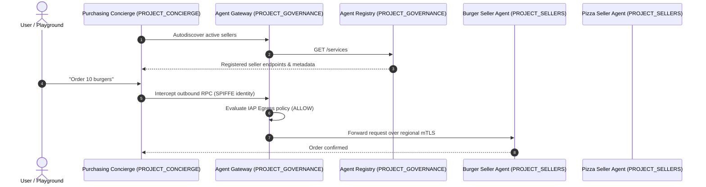

# Multi-Project Multi-Agent Purchasing Concierge with Agent Gateway & Agent Runtime

This repository contains the deployment scripts, agent runtime packages, and sample code for the **Gemini Enterprise Agent Platform Cross-Project Multi-Agent Governance** codelab.

## Overview

The solution demonstrates how to build and govern a distributed multi-agent purchasing ecosystem across three Google Cloud projects using **Vertex AI Agent Runtime (Reasoning Engines)**, **Agent Gateway**, **Agent Registry**, and **Agent Identity (SPIFFE/IAP)**:

* **Central Governance Project (`PROJECT_GOVERNANCE`):** Hosts the Central Agent Gateway (`AGENT_TO_ANYWHERE` mode), Central Agent Registry catalog, and IAP authorization policies.
* **Consumer Orchestrator Project (`PROJECT_CONCIERGE`):** Hosts the *Purchasing Concierge Agent*, which dynamically autodiscovers seller endpoints and orchestrates food orders.
* **Domain Vendor Project (`PROJECT_SELLERS`):** Hosts specialized domain worker agents (*Burger Seller Agent* and *Pizza Seller Agent*).

## Key Highlights

1. **Central Egress & Governance:** Outbound traffic from agent containers is routed through a Central Agent Gateway, eliminating unmonitored egress and enforcing zero-trust policies.
2. **Dynamic Autodiscovery:** The Purchasing Concierge resolves seller agents dynamically at runtime via Central Agent Registry, removing hardcoded endpoints.
3. **Cryptographic Identity & Live Policy Enforcement:** Agent instances use SPIFFE machine identities evaluated by Identity-Aware Proxy (IAP). Access policies (`roles/iap.egressor`) can be granted or revoked in real time without restarting agent runtimes.

## Codelab Tutorial

> **Note:** The step-by-step interactive walkthrough and deployment instructions are available in the official Google Cloud Codelab:
>
> * **[Deploy and Govern Multi-Project AI Agents with Agent Gateway and Agent Registry](https://codelabs.developers.google.com/)** *(link will be updated upon publication)*

## Repository Structure

* `deploy_concierge_adk.py`: Deploy the root Purchasing Concierge to `PROJECT_CONCIERGE`.
* `deploy_sellers_adk.py` / `deploy_burger.py` / `deploy_pizza.py`: Deploy specialist seller agents to `PROJECT_SELLERS`.
* `purchasing_concierge/`: ADK application package and Agent Registry dynamic discovery callbacks.
* `burger_pkg/` & `pizza_pkg/`: Seller agent Reasoning Engine implementations.
* `test_concierge_order.py`: Validation query script.
* `cleanup_old_deployments.py`: Teardown and cleanup utility.
